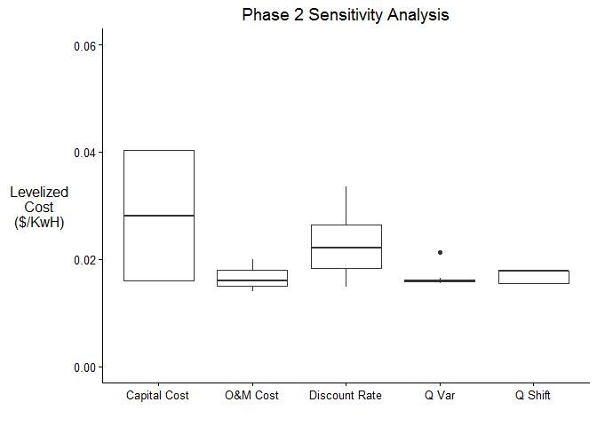

Phase 2 - Sensitivity Analysis
==============================

Overview
--------

Having exited Phase 1, we have already *classified* and *categorized*
our project, and identified it as potentially sensitive to climate
change. In Phase 2, we take a step back from climate change and answer a
more fundamental question: **is the success of this project relatively
or significantly sensitive to changes in streamflow?** Breaking down the
different parts of this question will help us understand how to approach
Phase 2, and what we can expect as a result at the end.

First, we are **interested in changes in streamflow, rather than changes
in climate** (e.g. temperature, precipitation, or other climatic
variables). Focusing our attention on streamflow allows us to avoid
having to create a hydrologic model before we conduct a sensitivity
analysis, which saves significant time at this stage. Because climate
and streamflow are often tightly linked, we can safely use sensitivity
to streamflow as a proxy for sensitivity to climate.

Next, we must **determine what it means to have a successful project**.
In Phase 2, this requires choosing a performance metric that we will use
to evaluate project outcomes. This could be the NPV of the project, its
reliability or safe yield, or anything else.

After choosing a performance metric, we must **choose other key,
non-climatic factors to evaluate in addition to streamflow**. This will
allow us to make comparisons of the project's sensitivity to different
factors, and, especially, evaluate its sensitivity to streamflow in the
proper context.

Next, we must **decide what ranges to explore for each factor**. Should
we consider a streamflow range of -30% to +30% from the historical norm,
or +/- 50%? Is there a potential for population to grow by 50%, or even
to double? These questions are crucial, as the ranges we choose are the
largest contributor to the final results of our sensitivity analysis.

Finally, we have to **define the equations that relate each factor to
our performance metric**. These equations may only be rough
approximations and will be fine-tuned if needed later in the process,
but they should be close enough to give a sense of the real picture.

Once we have all of this information, we can **conduct a "one-at-a-time"
sensitivity analysis**, varying one factor at a time within our defined
ranges to see how changes in that factor affect our performance metric.
It follows, then, that we must also pick sensible base values for each
factor, so that we can hold all but one factor constant.

Ultimately, the most important output we receive from Phase 2 is a box
plot which details the **results** of our sensitivity analysis.

On this plot, we have each factor plotted on the x-axis, with our
performance metric plotted on the y-axis. The boxes define the
sensitivity of the performance metric to variations in that factor. (For
more information on how to read a box plot, [see this
article.](http://www.wellbeingatschool.org.nz/information-sheet/understanding-and-interpreting-box-plots))
If our box for streamflow is sufficiently large compared those of the
other factors, than we may decide that we should move to Phase 3 and
perform a climate stress test. If, however, our box for streamflow is
very small compared to other, non-climatic, factors, then the focus of
our future work should be spent understanding and minimizing the
uncertainty of those other factors, rather than focusing on climate.

Phase 2 differs from Phase 1 in that we must begin collecting data about
the project to conduct our analysis. This data gathering is a crucial
component of Phase 2, and requires collaboration from all stakeholders.

The rest of this document describes each step required for Phase 2. We
explain how each step contributes to our final product (the box plot
displaying the results of our sensitivity analysis) Throughout, we use
an example run of the river hydropower plant located in Southern Asia to
illustrate some of the actions that will be taken at each step. The
appendix contains the R code used to perform the sensitivity analysis,
and is provided as an outline which can be adapted for your own project.

Step 1: Define the skeleton of our analysis
-------------------------------------------

Before we begin collecting any data, we must first determine what to
collect data *on*. This requires:

-   Defining the factors we wish to perform our sensitivity analysis on.
    This will certainly include streamflow, but will also include
    several non-climatic factors.
-   Defining the performance metric we will use to evaluate our project.

These definitions are best performed in the context of a stakeholder
meeting, with all relevant parties involved. For our example project, we
selected the levelized cost of energy as our performance metric, and
capital cost, O&M cost, and discount rate as our non-climatic factors.
Due to the nature of the monsoon season in Southern Asia and its effect
on hydropower, for streamflow we decided to examine both shifts in mean
streamflow throughout the year (Q Shift), and shifts in variability of
that streamflow (Q Var).

After Step 1 has been completed, we have all we need to define our plot
axes. The rest of the steps will help us to fill in the plot with actual
results.

Step 2: Gather design data and define ranges for sensitivity analysis
---------------------------------------------------------------------

Now that we have decided what factors to focus on for our sensitivity
analysis, we must begin collecting data. To evaluate our project, we
first have to gather fundamental information on its design. This
information has often already been compiled in previous consultancy or
feasibility studies, and so this step primarily consists of collecting
all of the relevant data from these reports and storing it in one
centralized place.

Beyond gathering design data, we have to define the ranges we will use
to perform our sensitivity analysis on. *How large or small we define
the ranges will affect the result of our sensitivity analysis more than
any other factor*. If a very large range is chosen for a given factor,
that factor will most likely dominate the result, and vice versa for a
very small range. For this reason, these ranges should be carefully
chosen based on two factors: the current best expert knowledge on what
values each factor might take, and the amount of uncertainty in this
expert knowledge. It is generally best to err on the side of caution and
choose a larger range than is expected, to avoid assumptions from
guiding a project away from progressing to Phase 3.

The information to define ranges often comes from a variety of sources.
For factors that relate to the construction or operation of the project,
consultancy or feasibility studies may include the required information.
For other non-climatic factors (e.g. population growth), a national
water plan, if one exists, is often the best source. These water plans
may also provide insight for how wide our streamflow range should be.

In the case of our example run of the river hydropower plant, Phase 2
ultimately consists of the following actions:

-   Related to the design of the dam, we determined the capacity of the
    dam, the construction time, the hydraulic head of the dam, the plant
    efficiency, and the expected economic lifetime.
-   We set base values (a single number) and ranges (an array
    of numbers) for each of our factors: capital cost, discount rate,
    and O&M. **streamflow?**
-   We determined the price of electricity and set it as a constant.

Step 3: Gather streamflow and climate data
------------------------------------------

Step 3 runs parallel to step 2 and involves collecting historical
streamflow, weather, and climate data. Technically, only streamflow data
is required for this step, as we will not use any other climate data for
our ultimate sensitivity analysis. However, if there is a reasonable
expectation that the project will need to continue to Phase 3 of the
Decision Tree Framework, collecting weather and climate data at this
time is often the most convenient.

Sources for this kind of data can vary greatly depending on the region
and project of interest. Agencies like NOAA offer globally gridded
data-sets, which can offer coarse data at the scale of several hundred
square kilometers. For more fine-grained data, often a national
meteorological service exists provides local weather and climate data.
In almost all cases, however, the most expedient way to collect this
information will be to meet with the stakeholders, who will be more
familiar with their own region's data collection efforts and will have
easier access to this data.

For our example project, we collected streamflow data from 1985-2006 and
prepared the data for use by removing missing values and obvious data
entry errors. We can combine this data with our design information of
our hydropower plant to calculate the energy produced on any date within
our historical range (1985-2006), which we need in order to calculate
the levelized cost of energy for our hydropower plant.

Step 4: Define equations that relate factors with our performance metric
------------------------------------------------------------------------

Now that we have all of our data, we need to relate each factor to our
performance metric. The equations to do this should be relatively
simple. Because of this, they will likely not be completely accurate --
but this is expected. Our goal here is only to generate an approximation
of the project's true sensitivity to each variable.

The equations that we will create will frequently incorporate the design
information of the project itself. They might even be included in any
feasibility studies already created for the project. For our example
project, we calculated 5 equations to relate each of our variables
(capital cost, O&M cost, discount rate, Q Var, and Q Shift) to levelized
cost of electricity.

Step 5: Conduct a sensitivity analysis
--------------------------------------

With all of our data collected and our equations defined, we can conduct
our actual sensitivity analysis. This follows a basic algorithm:

1.  Set base values for each factor.
2.  For the first factor, create an array of values that cover the range
    defined for that factor.
3.  Feed each value in the array created in 2 into the equation defined
    for that factor, along with the base values for all of the
    other factors. This will create an array of your performance metric
    that results from the range of values for your chosen factor.
4.  Repeat 2 and 3 for each factor.
5.  With the data produced from 1-4, produce a box plot.

The final result for our example project is shown in the plot below.

Step 6: Conclude whether or not to proceed to Phase 3
-----------------------------------------------------

The final step consists of analyzing the box plot to identify whether or
not this project warrants proceeding to Phase 3. If we examine the
result from our example project, we see that, with the ranges that we
chose, our performance metric is most sensitive to capital cost and
discount rate. Neither the ranges chosen for Q Var or Q Shift result in
a relatively significant change in our performance metric. Due to this,
it would be reasonable to conclude that Phase 3 is not necessary for
this project, opting instead to devote resources toward a more detailed
analysis of capital cost and discount rate.

Appendix: Example Code
======================

This code provides an example sensitivity analysis performed for a run
of the river hydropower plant. You can use this to provide a rough
outline for your own work.

    # install packages required for our analysis
    if (!require("pacman")) install.packages("pacman") # package managment tool
    pacman::p_load(dplyr, reshape2, stringr, ggplot2, scales, ggthemes)

    # -----------------------------------------------------------------------------
    # STEP 1: Define the skeleton of our analysis

    # The code in this step code generates the figure shown in step 1. It is not 
    # necessary to conducting the final sensitivity analysis.

    # Create a dummy data frame that contains our different factors
    sens_analysis <- data.frame(capital.cost = 1, om.cost = 1, dscnt.rate = 1, q.var = 1, q.shift = 1)
    sens_analysis <- melt(as.data.frame(sens_analysis), variable.name = "factor")

    # Create an empty plot with our factors on the x-axis and our performance metric
    # on the y-axis.
    empty_plot <- ggplot(sens_analysis, aes(factor(factor), value)) + geom_blank() +
      scale_x_discrete(labels = c("Capital \n Cost", "O&M \n Cost", "Discount \n Rate", "Q Var", "Q Shift"))    +
      scale_y_continuous(breaks = waiver(), labels = NULL) +
      labs(list(title = "Phase 2 Sensitivity Analysis", x = "", y = "Levelized\nCost\n($/KwH)")) +
      theme_classic() +
      theme(axis.title.y = element_text(angle = 0),
            axis.line.x = element_line(colour = 'black', linetype = 'solid'),
            axis.line.y = element_line(colour = 'black', linetype = 'solid'))

    # -----------------------------------------------------------------------------
    # STEP 2: Gather design data and define ranges for sensitivity analysis

    # Design parameters for 335 MW hydropower plant @ Q70
    mw_cap        <- 335            # capacity of dam, in MW
    cost_cap_base <- 450e6          # capital cost, in dollars
    t_constr      <- 60             # ??? construction time in months (5 yrs)
    H             <- 492            # hydraulic head, in meters
    e             <- 0.9            # plant efficiency - unknown, but assume 90%

    # unit conversion
    kwhr_cap      <- mw_cap*24*1000 # kWhr capacity per day for Q70  

    # Set baselines for factors
    dis_rate_base   <- 0.05
    cost_om_base    <- 2*(125000*(kwhr_cap/1000/24)^0.65) # annual O&M cost

    # Set ranges for factors
    cost_cap_range  <- cost_cap_base * c(1, 2, 3) # capital cost can be up to 3 times the base
    dis_rate_range  <- c(dis_rate_base, 0.07, 0.10, 0.12) # annual discount rate between 5-12%
    cost_om_range   <- c(seq(0.5, 1, 0.05), seq(1.1, 2, 0.1)) * cost_om_base # O&M range
     # streamflow...?

    #### Other constants
    price           <- 0.045        # price of electricity in Nepal in Nepalese Rupees per KWh
    econ_life       <- 30*12        # economic lifetime, in months AFTER end of construction
    sec_per_day     <- 60*60*24
    sec_per_hour    <- 60*60

    # -----------------------------------------------------------------------------
    # STEP 3: Gather streamflow and climate data

    # Get historical streamflow data
    strmflw <- read.csv("streamflow.csv", header = TRUE)

    # Remove missing values
    miss_val      <- which(is.na(strmflw[, 4])) 
    strmflw <- strmflw[-miss_val, ]

    q <- strmflw[, 4] # daily streamflow in m3/s

    # Equation below comes from Loucks and Van Beek, page 359, equation 11.70
    # (ISBN: 92-3-103998-9)
    # KWHt <- 9.81*q*H*(seconds per time interval)*e/(seconds per hour)

    KWH <- 9.81*q*H*e*sec_per_day/sec_per_hour # theoretical kilowatt-hrs produced, daily
    arun_hydro <- cbind(strmflw, KWH)

    # We can't produce more kilowatt-hrs than our dam has capacity for. Therefore,
    # we need to cap our theoretical yield if it exceeds our capacity.
    energy_day <- sapply(arun_hydro[, 6], function(x) min(x, kwhr_cap))
    arun_hydro[, 7] <- energy_day
    colnames(arun_hydro) <- c("Year","Month","Day","m3s","MCM","KWH","KWHcap")

    # -----------------------------------------------------------------------------
    # STEP 4: Define equations that relate factors with our performance metric
    # AND
    # STEP 5: Conduct a sensitivity analysis
    # (Note: Steps 4 and 5 are largely lumped together in
    #  the code below. The reader is encouraged to either combine these steps or
    #  separate them out in their implementation depending on their own
    #  preference.)

    # compute levelized cost of energy (LCE)
    # cap_cost         : A number or vector of numers representing the capital cost
    #                    of the project.
    # cost_om_pres_val : A number or vector of numbers that represent the present
    #                    value of the cost of O&M across ALL years.
    # energy_pres_val  : a vector of numbers that represent the present value
    #                    of the amount of energy generated across ALL years.
    lce <- function(cap_cost, cost_om_pres_val, energy_pres_val) {
      (cap_cost + cost_om_pres_val) / (energy_pres_val)
    }

    years <- 1:length(unique(arun_hydro[,1]))
    strmflw_ann <- as.matrix(group_by(arun_hydro, Year) %>% summarize(flow = sum(MCM)))
    energy_ann  <- as.matrix(group_by(arun_hydro, Year) %>% summarize(energy = sum(KWHcap)))

    energy_ann_avg  <- mean(energy_ann[, 2])

    energy_pres_val <- energy_ann_avg*(1+dis_rate_base)^(-years)
    cost_om_pres_val <- cost_om_base*(1+dis_rate_base)^(-years)

    #Capital cost sensitivity
    LCE_capital_cost <- lce(cost_cap_range,
                            sum(cost_om_pres_val),
                            sum(energy_pres_val))

    # O&M cost sensitivity
    cost_om_pres_val_range <- array(NA, c(length(years), length(cost_om_range)))
    for (i in 1:length(cost_om_range)) {
      cost_om_pres_val_range[,i] <- cost_om_range[i]*(1+dis_rate_base)^(-years)
    }
    sum_cost_om_pres_val <- apply(cost_om_pres_val_range, MARGIN=2, sum)
    LCE_om <- lce(cost_cap_base,
                  sum_cost_om_pres_val,
                  sum(energy_pres_val))

    # Discount rate sensitivity
    energy_pres_val_range <- array(NA, c(length(years), length(dis_rate_range)))
    for (i in 1:length(dis_rate_range)) {
     energy_pres_val_range[,i] <- energy_ann_avg*(1+dis_rate_range[i])^(-years)
     cost_om_pres_val_range[,i] <- cost_om_base*(1+dis_rate_range[i])^(-years)
    }
    sum_energy_pres_val <- apply(energy_pres_val_range, MARGIN=2, sum)
    sum_cost_om_pres_val <- apply(cost_om_pres_val_range, MARGIN=2, sum)
    LCE_dscnt <- lce(cost_cap_base,
                     sum_cost_om_pres_val,
                     sum_energy_pres_val)

    # Streamflow variability sensitivity
    num_stoch <- 19
    energy_stoch_1st <- seq(min(energy_ann[,2]), max(energy_ann[,2]),
                           (max(energy_ann[,2])-min(energy_ann[,2]))/(econ_life-1))
    energy_stoch_last <- seq(max(energy_ann[,2]), min(energy_ann[,2]),
                            -(max(energy_ann[,2])-min(energy_ann[,2])) / (econ_life-1))
    energy_stoch <- array(NA,c(length(years),num_stoch))
    for (i in 1:num_stoch) {
     order <- sample(1985:2006,length(years),replace=T)
     energy_stoch[,i] <- energy_ann[sapply(order, function(x) which(energy_ann[,1] == x)),2]
    }
    energy_range <- cbind(energy_stoch_1st,energy_stoch,energy_stoch_last)
    energy_range_pres_val <- array(NA,c(length(years),dim(energy_range)[2]))
    for (i in 1:dim(energy_range)[2]) {
     energy_range_pres_val[,i] <- energy_range[,i]*(1+dis_rate_base)^(-years)
    }
    sum_energy_range_pres_val <- apply(energy_range_pres_val,MARGIN=2,sum)
    LCE_qvar <- lce(cost_cap_base,
                    sum(cost_om_pres_val),
                    sum_energy_range_pres_val)

    # Streamflow mean sensitivity
    sd_flow <- sd(strmflw_ann[,2])
    mean_flow <- mean(strmflw_ann[,2])
    cv_strmflw_ann <- sd_flow / mean_flow
    #sd(strmflw[,5])/mean(strmflw[,5]) #check cv of daily streamflow - bigger than cv annual

    DQ_pos <- ((mean_flow*1.5-mean_flow)/mean_flow) #Either a custom ratio from the stress test or cv_strmflw_ann
    DQ_neg <- ((mean_flow-mean_flow*0.7)/mean_flow) #Either a custom ratio from the stress test or cv_strmflw_ann
    KWH_mcm <- 0.002725*arun_hydro[,5]*H*e*1e6
    high_flow <- arun_hydro[,5]*(1+DQ_pos)
    low_flow <- arun_hydro[,5]*(1-DQ_neg)
    arun_hydro[,8] <- high_flow
    arun_hydro[,9] <- low_flow
    arun_hydro[,10] <- 0.002725*arun_hydro[,8]*H*e*1e6
    arun_hydro[,11] <- 0.002725*arun_hydro[,9]*H*e*1e6

    energy_day_high <- sapply(arun_hydro[,10],function(x) min(x,kwhr_cap))
    arun_hydro[,12] <- energy_day_high
    energy_day_low <- sapply(arun_hydro[,11],function(x) min(x,kwhr_cap))
    arun_hydro[,13] <- energy_day_low
    colnames(arun_hydro) <- c("Year","Month","Day","m3s","MCM","KWH","KWHcap","high_flow","low_flow","KWH_high","KWH_low","KWHcap_high","KWHcap_low")

    strmflw_ann_high <- as.matrix(group_by(arun_hydro,Year) %>% summarize(flow=sum(high_flow)))
    energy_ann_high <- as.matrix(group_by(arun_hydro,Year) %>% summarize(energy=sum(KWHcap_high)))
    energy_ann_avg_high <- as.numeric(group_by(arun_hydro,Year) %>% summarize(energy=sum(KWHcap_high)) %>% summarize(avg=mean(energy)))
    energy_pres_val_high <- energy_ann_avg_high*(1+dis_rate_base)^(-years)
    LCE_qshift_high <- lce(cost_cap_base,
                           sum(cost_om_pres_val),
                           sum(energy_pres_val_high))

    strmflw_ann_low <- as.matrix(group_by(arun_hydro,Year) %>% summarize(flow=sum(low_flow)))
    energy_ann_low <- as.matrix(group_by(arun_hydro,Year) %>% summarize(energy=sum(KWHcap_low)))
    energy_ann_avg_low <- as.numeric(group_by(arun_hydro,Year) %>% summarize(energy=sum(KWHcap_low)) %>% summarize(avg=mean(energy)))
    energy_pres_val_low <- energy_ann_avg_low*(1+dis_rate_base)^(-years)
    LCE_qshift_low <- lce(cost_cap_base,
                          sum(cost_om_pres_val),
                          sum(energy_pres_val_low))

    LCE_qshift <- c(LCE_qshift_low, LCE_qshift_high)

    # Create box plot
    sens_analysis <- cbind(LCE_capital_cost, LCE_om, LCE_dscnt, LCE_qvar, LCE_qshift)
    colnames(sens_analysis) <- c("capital.cost","om.cost","dscnt.rate","q.var","q.shift")
    sens_analysis <- melt(as.data.frame(sens_analysis), variable.name = "factor")

    plot <- ggplot(sens_analysis, aes(factor(factor), value)) + geom_boxplot() +
       #theme_classic() +
       scale_x_discrete(labels=c("Capital Cost", "O&M Cost", "Discount Rate", "Q Var", "Q Shift"))  +
       scale_y_continuous(limits = c(0,0.06)) +
       labs(list(title = "Phase 2 Sensitivity Analysis", x = "", y = "Levelized\nCost\n($/KwH)")) +
       theme_classic() +
       theme(axis.title.y = element_text(angle = 0),
             axis.line.x = element_line(colour = 'black', linetype = 'solid'),
             axis.line.y = element_line(colour = 'black', linetype = 'solid')) +
       geom_hline(yintercept=price, colour = "red")
    plot

