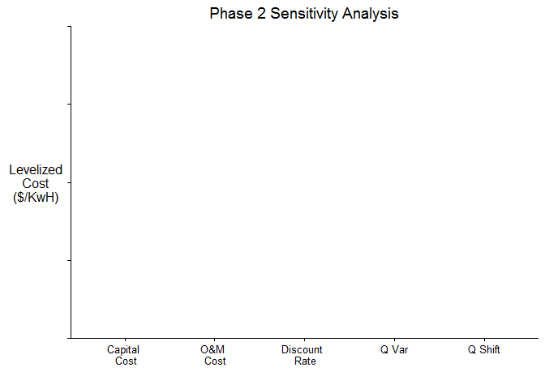

Phase 2 - Sensitivity Analysis
==============================

Overview
--------

Having exited Phase 1, we have already *classified* and *categorized*
our project, and identified it as potentially sensitive to climate
change. In Phase 2, we take a step back from climate change and answer a
more fundamental question: **is the success of this project relatively
or significantly sensitive to changes in streamflow?** Breaking down the
different parts of this question will help us understand how to approach
Phase 2, and what we can expect as a result at the end.

First, we are **interested in changes in streamflow, rather than changes
in climate** (e.g. temperature, precipitation, or other climatic
variables). Focusing our attention on streamflow allows us to avoid
having to create a hydrologic model before we conduct a sensitivity
analysis, which saves significant time at this stage. Because climate
and streamflow are often tightly linked, we can safely use sensitivity
to streamflow as a proxy for sensitivity to climate.

Next, we must **determine what it means to have a successful project**.
In Phase 2, this requires choosing a performance metric that we will use
to evaluate project outcomes. This could be the NPV of the project, its
reliability or safe yield, or anything else.

After choosing a performance metric, we must **choose other key,
non-climatic factors to evaluate in addition to streamflow**. This will
allow us to make comparisons of the project's sensitivity to different
factors, and, especially, evaluate its sensitivity to streamflow in the
proper context.

Next, we must **decide what ranges to explore for each factor**. Should
we consider a streamflow range of -30% to +30% from the historical norm,
or +/- 50%? Is there a potential for population to grow by 50%, or even
to double? These questions are crucial, as the ranges we choose are the
largest contributor to the final results of our sensitivity analysis.

Finally, we have to **define the equations that relate each factor to
our performance metric**. These equations may only be rough
approximations and will be fine-tuned if needed later in the process,
but they should be close enough to give a sense of the real picture.

Once we have all of this information, we can **conduct a "one-at-a-time"
sensitivity analysis**, varying one factor at a time within our defined
ranges to see how changes in that factor affect our performance metric.
It follows, then, that we must also pick sensible base values for each
factor, so that we can hold all but one factor constant.

Ultimately, the most important output we receive from Phase 2 is a box
plot which details the **results** of our sensitivity analysis.

On this plot, we have each factor plotted on the x-axis, with our
performance metric plotted on the y-axis. The boxes define the
sensitivity of the performance metric to variations in that factor. (For
more information on how to read a box plot, [see this
article.](http://www.wellbeingatschool.org.nz/information-sheet/understanding-and-interpreting-box-plots))
If our box for streamflow is sufficiently large compared those of the
other factors, than we may decide that we should move to Phase 3 and
perform a climate stress test. If, however, our box for streamflow is
very small compared to other, non-climatic, factors, then the focus of
our future work should be spent understanding and minimizing the
uncertainty of those other factors, rather than focusing on climate.

Phase 2 differs from Phase 1 in that we must begin collecting data about
the project to conduct our analysis. This data gathering is a crucial
component of Phase 2, and requires collaboration from all stakeholders.

The rest of this document describes each step required for Phase 2. We
explain how each step contributes to our final product (the box plot
displaying the results of our sensitivity analysis) Throughout, we use
an example run of the river hydropower plant located in Southern Asia to
illustrate some of the actions that will be taken at each step. The
appendix contains the R code used to perform the sensitivity analysis,
and is provided as an outline which can be adapted for your own project.

Step 1: Define the skeleton of our analysis
-------------------------------------------

Before we begin collecting any data, we must first determine what to
collect data *on*. This requires:

-   Defining the factors we wish to perform our sensitivity analysis on.
    This will certainly include streamflow, but will also include
    several non-climatic factors.
-   Defining the performance metric we will use to evaluate our project.

These definitions are best performed in the context of a stakeholder
meeting, with all relevant parties involved. For our example project, we
selected the levelized cost of energy as our performance metric, and
capital cost, O&M cost, and discount rate as our non-climatic factors.
Due to the nature of the monsoon season in Southern Asia and its effect
on hydropower, for streamflow we decided to examine both shifts in mean
streamflow throughout the year (Q Shift), and shifts in variability of
that streamflow (Q Var).

After Step 1 has been completed, we have all we need to define our plot
axes. The rest of the steps will help us to fill in the plot with actual
results.

Step 2: Gather design data and define ranges for sensitivity analysis
---------------------------------------------------------------------

Now that we have decided what factors to focus on for our sensitivity
analysis, we must begin collecting data. To evaluate our project, we
first have to gather fundamental information on its design. This
information has often already been compiled in previous consultancy or
feasibility studies, and so this step primarily consists of collecting
all of the relevant data from these reports and storing it in one
centralized place.

Beyond gathering design data, we have to define the ranges we will use
to perform our sensitivity analysis on. *How large or small we define
the ranges will affect the result of our sensitivity analysis more than
any other factor*. If a very large range is chosen for a given factor,
that factor will most likely dominate the result, and vice versa for a
very small range. For this reason, these ranges should be carefully
chosen based on two factors: the current best expert knowledge on what
values each factor might take, and the amount of uncertainty in this
expert knowledge. It is generally best to err on the side of caution and
choose a larger range than is expected, to avoid assumptions from
guiding a project away from progressing to Phase 3.

The information to define ranges often comes from a variety of sources.
For factors that relate to the construction or operation of the project,
consultancy or feasibility studies may include the required information.
For other non-climatic factors (e.g. population growth), a national
water plan, if one exists, is often the best source. These water plans
may also provide insight for how wide our streamflow range should be.

In the case of our example run of the river hydropower plant, Phase 2
ultimately consists of the following actions:

-   Related to the design of the dam, we determined the capacity of the
    dam, the construction time, the hydraulic head of the dam, the plant
    efficiency, and the expected economic lifetime.
-   We set base values (a single number) and ranges (an array
    of numbers) for each of our factors: capital cost, discount rate,
    and O&M. **streamflow?**
-   We determined the price of electricity and set it as a constant.

Step 3: Gather streamflow and climate data
------------------------------------------

Step 3 runs parallel to step 2 and involves collecting historical
streamflow, weather, and climate data. Technically, only streamflow data
is required for this step, as we will not use any other climate data for
our ultimate sensitivity analysis. However, if there is a reasonable
expectation that the project will need to continue to Phase 3 of the
Decision Tree Framework, collecting weather and climate data at this
time is often the most convenient.

Sources for this kind of data can vary greatly depending on the region
and project of interest. Agencies like NOAA offer globally gridded
data-sets, which can offer coarse data at the scale of several hundred
square kilometers. For more fine-grained data, often a national
meteorological service exists provides local weather and climate data.
In almost all cases, however, the most expedient way to collect this
information will be to meet with the stakeholders, who will be more
familiar with their own region's data collection efforts and will have
easier access to this data.

For our example project, we collected streamflow data from 1985-2006 and
prepared the data for use by removing missing values and obvious data
entry errors. We can combine this data with our design information of
our hydropower plant to calculate the energy produced on any date within
our historical range (1985-2006), which we need in order to calculate
the levelized cost of energy for our hydropower plant.

Step 4: Define equations that relate factors with our performance metric
------------------------------------------------------------------------

Now that we have all of our data, we need to relate each factor to our
performance metric. The equations to do this should be relatively
simple. Because of this, they will likely not be completely accurate --
but this is expected. Our goal here is only to generate an approximation
of the project's true sensitivity to each variable.

The equations that we will create will frequently incorporate the design
information of the project itself. They might even be included in any
feasibility studies already created for the project. For our example
project, we calculated 5 equations to relate each of our variables
(capital cost, O&M cost, discount rate, Q Var, and Q Shift) to levelized
cost of electricity.

Step 5: Conduct a sensitivity analysis
--------------------------------------

With all of our data collected and our equations defined, we can conduct
our actual sensitivity analysis. This follows a basic algorithm:

1.  Set base values for each factor.
2.  For the first factor, create an array of values that cover the range
    defined for that factor.
3.  Feed each value in the array created in 2 into the equation defined
    for that factor, along with the base values for all of the
    other factors. This will create an array of your performance metric
    that results from the range of values for your chosen factor.
4.  Repeat 2 and 3 for each factor.
5.  With the data produced from 1-4, produce a box plot.

The final result for our example project is shown in the plot below.

Step 6: Conclude whether or not to proceed to Phase 3
-----------------------------------------------------

The final step consists of analyzing the box plot to identify whether or
not this project warrants proceeding to Phase 3. If we examine the
result from our example project, we see that, with the ranges that we
chose, our performance metric is most sensitive to capital cost and
discount rate. Neither the ranges chosen for Q Var or Q Shift result in
a relatively significant change in our performance metric. Due to this,
it would be reasonable to conclude that Phase 3 is not necessary for
this project, opting instead to devote resources toward a more detailed
analysis of capital cost and discount rate.

Appendix: Example Code
======================

This code provides an example sensitivity analysis performed for a run
of the river hydropower plant. You can use this to provide a rough
outline for your own work.

    # install packages required for our analysis
    if (!require("pacman")) install.packages("pacman") # package managment tool
    pacman::p_load(dplyr, reshape2, stringr, ggplot2, scales, ggthemes)

    # -----------------------------------------------------------------------------
    # STEP 1: Define the skeleton of our analysis

    # The code in this step code generates the figure shown in step 1. It is not 
    # necessary to conducting the final sensitivity analysis.

    # Create a dummy data frame that contains our different factors
    sens_analysis <- data.frame(capital.cost = 1, om.cost = 1, dscnt.rate = 1, q.var = 1, q.shift = 1)
    sens_analysis <- melt(as.data.frame(sens_analysis), variable.name = "factor")

    # Create an empty plot with our factors on the x-axis and our performance metric
    # on the y-axis.
    empty_plot <- ggplot(sens_analysis, aes(factor(factor), value)) + geom_blank() +
      scale_x_discrete(labels = c("Capital \n Cost", "O&M \n Cost", "Discount \n Rate", "Q Var", "Q Shift"))    +
      scale_y_continuous(breaks = waiver(), labels = NULL) +
      labs(list(title = "Phase 2 Sensitivity Analysis", x = "", y = "Levelized\nCost\n($/KwH)")) +
      theme_classic() +
      theme(axis.title.y = element_text(angle = 0),
            axis.line.x = element_line(colour = 'black', linetype = 'solid'),
            axis.line.y = element_line(colour = 'black', linetype = 'solid'))

    # -----------------------------------------------------------------------------
    # STEP 2: Gather design data and define ranges for sensitivity analysis

    # Design parameters for 335 MW hydropower plant @ Q70
    mw_cap        <- 335            # capacity of dam, in MW
    cost_cap_base <- 450e6          # capital cost, in dollars
    t_constr      <- 60             # ??? construction time in months (5 yrs)
    H             <- 492            # hydraulic head, in meters
    e             <- 0.9            # plant efficiency - unknown, but assume 90%

    # unit conversion
    kwhr_cap      <- mw_cap*24*1000 # kWhr capacity per day for Q70  

    # Set baselines for factors
    dis_rate_base   <- 0.05
    cost_om_base    <- 2*(125000*(kwhr_cap/1000/24)^0.65) # annual O&M cost

    # Set ranges for factors
    cost_cap_range  <- cost_cap_base * c(1, 2, 3) # capital cost can be up to 3 times the base
    dis_rate_range  <- c(dis_rate_base, 0.07, 0.10, 0.12) # annual discount rate between 5-12%
    cost_om_range   <- c(seq(0.5, 1, 0.05), seq(1.1, 2, 0.1)) * cost_om_base # O&M range
     # streamflow...?

    #### Other constants
    price           <- 0.045        # price of electricity in Nepal in Nepalese Rupees per KWh
    econ_life       <- 30*12        # economic lifetime, in months AFTER end of construction
    sec_per_day     <- 60*60*24
    sec_per_hour    <- 60*60

    # -----------------------------------------------------------------------------
    # STEP 3: Gather streamflow and climate data

    # Get historical streamflow data
    strmflw <- read.csv("streamflow.csv", header = TRUE)
    print(strmflw)

    ##      Year Month Day Streamflow..m3.s. Streamflow..MCM.
    ## 1    1985   Apr  15             102.0          8.81280
    ## 2    1985   Apr  16             102.0          8.81280
    ## 3    1985   Apr  17              94.3          8.14752
    ## 4    1985   Apr  18              92.1          7.95744
    ## 5    1985   Apr  19              92.1          7.95744
    ## 6    1985   Apr  20             102.0          8.81280
    ## 7    1985   Apr  21             102.0          8.81280
    ## 8    1985   Apr  22             117.0         10.10880
    ## 9    1985   Apr  23             103.0          8.89920
    ## 10   1985   Apr  24             102.0          8.81280
    ## 11   1985   Apr  25             102.0          8.81280
    ## 12   1985   Apr  26             102.0          8.81280
    ## 13   1985   Apr  27             102.0          8.81280
    ## 14   1985   Apr  28              99.8          8.62272
    ## 15   1985   Apr  29              98.7          8.52768
    ## 16   1985   Apr  30              96.5          8.33760
    ## 17   1985   May   1              93.2          8.05248
    ## 18   1985   May   2             104.0          8.98560
    ## 19   1985   May   3             120.0         10.36800
    ## 20   1985   May   4             123.0         10.62720
    ## 21   1985   May   5             101.0          8.72640
    ## 22   1985   May   6             117.0         10.10880
    ## 23   1985   May   7             117.0         10.10880
    ## 24   1985   May   8             109.0          9.41760
    ## 25   1985   May   9             113.0          9.76320
    ## 26   1985   May  10             108.0          9.33120
    ## 27   1985   May  11             122.0         10.54080
    ## 28   1985   May  12             128.0         11.05920
    ## 29   1985   May  13             115.0          9.93600
    ## 30   1985   May  14             138.0         11.92320
    ## 31   1985   May  15             130.0         11.23200
    ## 32   1985   May  16             117.0         10.10880
    ## 33   1985   May  17             122.0         10.54080
    ## 34   1985   May  18             114.0          9.84960
    ## 35   1985   May  19             118.0         10.19520
    ## 36   1985   May  20             114.0          9.84960
    ## 37   1985   May  21             162.0         13.99680
    ## 38   1985   May  22             127.0         10.97280
    ## 39   1985   May  23             123.0         10.62720
    ## 40   1985   May  24             119.0         10.28160
    ## 41   1985   May  25             126.0         10.88640
    ## 42   1985   May  26             186.0         16.07040
    ## 43   1985   May  27             207.0         17.88480
    ## 44   1985   May  28             383.0         33.09120
    ## 45   1985   May  29             272.0         23.50080
    ## 46   1985   May  30             278.0         24.01920
    ## 47   1985   May  31             289.0         24.96960
    ## 48   1985   Jun   1             456.0         39.39840
    ## 49   1985   Jun   2             391.0         33.78240
    ## 50   1985   Jun   3             345.0         29.80800
    ## 51   1985   Jun   4             519.0         44.84160
    ## 52   1985   Jun   5             347.0         29.98080
    ## 53   1985   Jun   6             287.0         24.79680
    ## 54   1985   Jun   7             345.0         29.80800
    ## 55   1985   Jun   8             285.0         24.62400
    ## 56   1985   Jun   9             486.0         41.99040
    ## 57   1985   Jun  10             376.0         32.48640
    ## 58   1985   Jun  11             282.0         24.36480
    ## 59   1985   Jun  12             259.0         22.37760
    ## 60   1985   Jun  13             282.0         24.36480
    ## 61   1985   Jun  14             287.0         24.79680
    ## 62   1985   Jun  15             297.0         25.66080
    ## 63   1985   Jun  16             388.0         33.52320
    ## 64   1985   Jun  17             599.0         51.75360
    ## 65   1985   Jun  18             525.0         45.36000
    ## 66   1985   Jun  19             590.0         50.97600
    ## 67   1985   Jun  20             475.0         41.04000
    ## 68   1985   Jun  21             438.0         37.84320
    ## 69   1985   Jun  22             443.0         38.27520
    ## 70   1985   Jun  23             575.0         49.68000
    ## 71   1985   Jun  24             660.0         57.02400
    ## 72   1985   Jun  25             533.0         46.05120
    ## 73   1985   Jun  26             569.0         49.16160
    ## 74   1985   Jun  27             511.0         44.15040
    ## 75   1985   Jun  28             663.0         57.28320
    ## 76   1985   Jun  29             755.0         65.23200
    ## 77   1985   Jun  30             653.0         56.41920
    ## 78   1985   Jul   1             590.0         50.97600
    ## 79   1985   Jul   2             587.0         50.71680
    ## 80   1985   Jul   3             578.0         49.93920
    ## 81   1985   Jul   4            1050.0         90.72000
    ## 82   1985   Jul   5             727.0         62.81280
    ## 83   1985   Jul   6             741.0         64.02240
    ## 84   1985   Jul   7             858.0         74.13120
    ## 85   1985   Jul   8             877.0         75.77280
    ## 86   1985   Jul   9             839.0         72.48960
    ## 87   1985   Jul  10             802.0         69.29280
    ## 88   1985   Jul  11             703.0         60.73920
    ## 89   1985   Jul  12             843.0         72.83520
    ## 90   1985   Jul  13             877.0         75.77280
    ## 91   1985   Jul  14            1030.0         88.99200
    ## 92   1985   Jul  15            1060.0         91.58400
    ## 93   1985   Jul  16             998.0         86.22720
    ## 94   1985   Jul  17            1060.0         91.58400
    ## 95   1985   Jul  18             854.0         73.78560
    ## 96   1985   Jul  19             839.0         72.48960
    ## 97   1985   Jul  20             828.0         71.53920
    ## 98   1985   Jul  21             953.0         82.33920
    ## 99   1985   Jul  22             877.0         75.77280
    ## 100  1985   Jul  23             977.0         84.41280
    ## 101  1985   Jul  24             961.0         83.03040
    ## 102  1985   Jul  25            1010.0         87.26400
    ## 103  1985   Jul  26             957.0         82.68480
    ## 104  1985   Jul  27            1010.0         87.26400
    ## 105  1985   Jul  28            1100.0         95.04000
    ## 106  1985   Jul  29             937.0         80.95680
    ## 107  1985   Jul  30             798.0         68.94720
    ## 108  1985   Jul  31             730.0         63.07200
    ## 109  1985   Aug   1             696.0         60.13440
    ## 110  1985   Aug   2             643.0         55.55520
    ## 111  1985   Aug   3             599.0         51.75360
    ## 112  1985   Aug   4             624.0         53.91360
    ## 113  1985   Aug   5             584.0         50.45760
    ## 114  1985   Aug   6             569.0         49.16160
    ## 115  1985   Aug   7             545.0         47.08800
    ## 116  1985   Aug   8             548.0         47.34720
    ## 117  1985   Aug   9             548.0         47.34720
    ## 118  1985   Aug  10             569.0         49.16160
    ## 119  1985   Aug  11             548.0         47.34720
    ## 120  1985   Aug  12             599.0         51.75360
    ## 121  1985   Aug  13             563.0         48.64320
    ## 122  1985   Aug  14             737.0         63.67680
    ## 123  1985   Aug  15             663.0         57.28320
    ## 124  1985   Aug  16             653.0         56.41920
    ## 125  1985   Aug  17             599.0         51.75360
    ## 126  1985   Aug  18             686.0         59.27040
    ## 127  1985   Aug  19             917.0         79.22880
    ## 128  1985   Aug  20             850.0         73.44000
    ## 129  1985   Aug  21             929.0         80.26560
    ## 130  1985   Aug  22             977.0         84.41280
    ## 131  1985   Aug  23            1190.0        102.81600
    ## 132  1985   Aug  24            1390.0        120.09600
    ## 133  1985   Aug  25            1140.0         98.49600
    ## 134  1985   Aug  26             957.0         82.68480
    ## 135  1985   Aug  27             869.0         75.08160
    ## 136  1985   Aug  28             850.0         73.44000
    ## 137  1985   Aug  29             828.0         71.53920
    ## 138  1985   Aug  30             850.0         73.44000
    ## 139  1985   Aug  31             828.0         71.53920
    ## 140  1985   Sep   1             929.0         80.26560
    ## 141  1985   Sep   2             921.0         79.57440
    ## 142  1985   Sep   3            1010.0         87.26400
    ## 143  1985   Sep   4            1080.0         93.31200
    ## 144  1985   Sep   5            1410.0        121.82400
    ## 145  1985   Sep   6            1130.0         97.63200
    ## 146  1985   Sep   7             929.0         80.26560
    ## 147  1985   Sep   8             813.0         70.24320
    ## 148  1985   Sep   9             741.0         64.02240
    ## 149  1985   Sep  10             673.0         58.14720
    ## 150  1985   Sep  11             737.0         63.67680
    ## 151  1985   Sep  12             696.0         60.13440
    ## 152  1985   Sep  13             640.0         55.29600
    ## 153  1985   Sep  14             696.0         60.13440
    ## 154  1985   Sep  15             624.0         53.91360
    ## 155  1985   Sep  16             791.0         68.34240
    ## 156  1985   Sep  17             766.0         66.18240
    ## 157  1985   Sep  18             663.0         57.28320
    ## 158  1985   Sep  19             686.0         59.27040
    ## 159  1985   Sep  20             773.0         66.78720
    ## 160  1985   Sep  21             627.0         54.17280
    ## 161  1985   Sep  22             590.0         50.97600
    ## 162  1985   Sep  23             560.0         48.38400
    ## 163  1985   Sep  24             557.0         48.12480
    ## 164  1985   Sep  25             599.0         51.75360
    ## 165  1985   Sep  26             630.0         54.43200
    ## 166  1985   Sep  27             519.0         44.84160
    ## 167  1985   Sep  28             503.0         43.45920
    ## 168  1985   Sep  29             505.0         43.63200
    ## 169  1985   Sep  30             443.0         38.27520
    ## 170  1985   Oct   1             405.0         34.99200
    ## 171  1985   Oct   2             381.0         32.91840
    ## 172  1985   Oct   3             354.0         30.58560
    ## 173  1985   Oct   4             332.0         28.68480
    ## 174  1985   Oct   5             316.0         27.30240
    ## 175  1985   Oct   6             301.0         26.00640
    ## 176  1985   Oct   7             289.0         24.96960
    ## 177  1985   Oct   8             282.0         24.36480
    ## 178  1985   Oct   9             283.0         24.45120
    ## 179  1985   Oct  10             478.0         41.29920
    ## 180  1985   Oct  11             358.0         30.93120
    ## 181  1985   Oct  12             329.0         28.42560
    ## 182  1985   Oct  13             338.0         29.20320
    ## 183  1985   Oct  14             280.0         24.19200
    ## 184  1985   Oct  15             283.0         24.45120
    ## 185  1985   Oct  16             283.0         24.45120
    ## 186  1985   Oct  17             511.0         44.15040
    ## 187  1985   Oct  18             945.0         81.64800
    ## 188  1985   Oct  19             503.0         43.45920
    ## 189  1985   Oct  20             422.0         36.46080
    ## 190  1985   Oct  21             351.0         30.32640
    ## 191  1985   Oct  22             310.0         26.78400
    ## 192  1985   Oct  23             289.0         24.96960
    ## 193  1985   Oct  24             268.0         23.15520
    ## 194  1985   Oct  25             255.0         22.03200
    ## 195  1985   Oct  26             240.0         20.73600
    ## 196  1985   Oct  27             231.0         19.95840
    ## 197  1985   Oct  28             222.0         19.18080
    ## 198  1985   Oct  29             214.0         18.48960
    ## 199  1985   Oct  30             202.0         17.45280
    ## 200  1985   Oct  31             197.0         17.02080
    ## 201  1985   Nov   1             191.0         16.50240
    ## 202  1985   Nov   2             186.0         16.07040
    ## 203  1985   Nov   3             192.0         16.58880
    ## 204  1985   Nov   4             183.0         15.81120
    ## 205  1985   Nov   5             173.0         14.94720
    ## 206  1985   Nov   6             184.0         15.89760
    ## 207  1985   Nov   7             170.0         14.68800
    ## 208  1985   Nov   8             170.0         14.68800
    ## 209  1985   Nov   9             170.0         14.68800
    ## 210  1985   Nov  10             168.0         14.51520
    ## 211  1985   Nov  11             170.0         14.68800
    ## 212  1985   Nov  12             167.0         14.42880
    ## 213  1985   Nov  13             166.0         14.34240
    ## 214  1985   Nov  14             156.0         13.47840
    ## 215  1985   Nov  15             154.0         13.30560
    ## 216  1985   Nov  16             147.0         12.70080
    ## 217  1985   Nov  17             142.0         12.26880
    ## 218  1985   Nov  18             137.0         11.83680
    ## 219  1985   Nov  19             134.0         11.57760
    ## 220  1985   Nov  20             133.0         11.49120
    ## 221  1985   Nov  21             142.0         12.26880
    ## 222  1985   Nov  22             126.0         10.88640
    ## 223  1985   Nov  23             124.0         10.71360
    ## 224  1985   Nov  24             122.0         10.54080
    ## 225  1985   Nov  25             122.0         10.54080
    ## 226  1985   Nov  26             120.0         10.36800
    ## 227  1985   Nov  27             119.0         10.28160
    ## 228  1985   Nov  28             118.0         10.19520
    ## 229  1985   Nov  29             114.0          9.84960
    ## 230  1985   Nov  30             114.0          9.84960
    ## 231  1985   Dec   1             114.0          9.84960
    ## 232  1985   Dec   2             114.0          9.84960
    ## 233  1985   Dec   3             114.0          9.84960
    ## 234  1985   Dec   4             114.0          9.84960
    ## 235  1985   Dec   5             110.0          9.50400
    ## 236  1985   Dec   6             110.0          9.50400
    ## 237  1985   Dec   7             109.0          9.41760
    ## 238  1985   Dec   8             110.0          9.50400
    ## 239  1985   Dec   9             110.0          9.50400
    ## 240  1985   Dec  10             108.0          9.33120
    ## 241  1985   Dec  11             108.0          9.33120
    ## 242  1985   Dec  12             107.0          9.24480
    ## 243  1985   Dec  13             110.0          9.50400
    ## 244  1985   Dec  14             109.0          9.41760
    ## 245  1985   Dec  15             108.0          9.33120
    ## 246  1985   Dec  16             106.0          9.15840
    ## 247  1985   Dec  17             106.0          9.15840
    ## 248  1985   Dec  18             106.0          9.15840
    ## 249  1985   Dec  19             106.0          9.15840
    ## 250  1985   Dec  20             104.0          8.98560
    ## 251  1985   Dec  21             104.0          8.98560
    ## 252  1985   Dec  22             103.0          8.89920
    ## 253  1985   Dec  23             102.0          8.81280
    ## 254  1985   Dec  24             102.0          8.81280
    ## 255  1985   Dec  25              99.8          8.62272
    ## 256  1985   Dec  26              97.6          8.43264
    ## 257  1985   Dec  27             117.0         10.10880
    ## 258  1985   Dec  28             106.0          9.15840
    ## 259  1985   Dec  29              96.5          8.33760
    ## 260  1985   Dec  30              94.3          8.14752
    ## 261  1985   Dec  31              94.3          8.14752
    ## 262  1986   Jan   1              96.5          8.33760
    ## 263  1986   Jan   2              92.1          7.95744
    ## 264  1986   Jan   3              95.4          8.24256
    ## 265  1986   Jan   4              88.0          7.60320
    ## 266  1986   Jan   5              88.0          7.60320
    ## 267  1986   Jan   6              92.1          7.95744
    ## 268  1986   Jan   7              91.0          7.86240
    ## 269  1986   Jan   8              87.0          7.51680
    ## 270  1986   Jan   9              85.0          7.34400
    ## 271  1986   Jan  10              83.0          7.17120
    ## 272  1986   Jan  11              83.0          7.17120
    ## 273  1986   Jan  12              83.0          7.17120
    ## 274  1986   Jan  13              78.3          6.76512
    ## 275  1986   Jan  14              81.0          6.99840
    ## 276  1986   Jan  15              81.0          6.99840
    ## 277  1986   Jan  16              78.3          6.76512
    ## 278  1986   Jan  17              73.8          6.37632
    ## 279  1986   Jan  18              76.5          6.60960
    ## 280  1986   Jan  19              74.7          6.45408
    ## 281  1986   Jan  20              75.6          6.53184
    ## 282  1986   Jan  21              76.5          6.60960
    ## 283  1986   Jan  22              77.4          6.68736
    ## 284  1986   Jan  23              77.4          6.68736
    ## 285  1986   Jan  24              77.4          6.68736
    ## 286  1986   Jan  25              79.2          6.84288
    ## 287  1986   Jan  26              78.3          6.76512
    ## 288  1986   Jan  27              79.2          6.84288
    ## 289  1986   Jan  28              75.6          6.53184
    ## 290  1986   Jan  29              77.4          6.68736
    ## 291  1986   Jan  30              77.4          6.68736
    ## 292  1986   Jan  31              76.5          6.60960
    ## 293  1986   Feb   1              72.0          6.22080
    ## 294  1986   Feb   2              76.5          6.60960
    ## 295  1986   Feb   3              76.5          6.60960
    ## 296  1986   Feb   4              77.4          6.68736
    ## 297  1986   Feb   5              82.0          7.08480
    ## 298  1986   Feb   6              81.0          6.99840
    ## 299  1986   Feb   7              76.5          6.60960
    ## 300  1986   Feb   8              71.1          6.14304
    ## 301  1986   Feb   9              73.8          6.37632
    ## 302  1986   Feb  10              76.5          6.60960
    ## 303  1986   Feb  11              81.0          6.99840
    ## 304  1986   Feb  12              78.3          6.76512
    ## 305  1986   Feb  13              76.5          6.60960
    ## 306  1986   Feb  14              77.4          6.68736
    ## 307  1986   Feb  15              76.5          6.60960
    ## 308  1986   Feb  16              72.0          6.22080
    ## 309  1986   Feb  17              74.7          6.45408
    ## 310  1986   Feb  18              71.1          6.14304
    ## 311  1986   Feb  19              72.0          6.22080
    ## 312  1986   Feb  20              74.7          6.45408
    ## 313  1986   Feb  21              81.0          6.99840
    ## 314  1986   Feb  22              84.0          7.25760
    ## 315  1986   Feb  23              93.2          8.05248
    ## 316  1986   Feb  24              86.0          7.43040
    ## 317  1986   Feb  25              86.0          7.43040
    ## 318  1986   Feb  26              83.0          7.17120
    ## 319  1986   Feb  27              81.0          6.99840
    ## 320  1986   Feb  28              81.0          6.99840
    ## 321  1986   Mar   1              76.5          6.60960
    ## 322  1986   Mar   2              72.0          6.22080
    ## 323  1986   Mar   3              81.0          6.99840
    ## 324  1986   Mar   4              78.3          6.76512
    ## 325  1986   Mar   5              85.0          7.34400
    ## 326  1986   Mar   6              84.0          7.25760
    ## 327  1986   Mar   7              81.0          6.99840
    ## 328  1986   Mar   8              81.0          6.99840
    ## 329  1986   Mar   9              83.0          7.17120
    ## 330  1986   Mar  10              89.0          7.68960
    ## 331  1986   Mar  11              87.0          7.51680
    ## 332  1986   Mar  12              87.0          7.51680
    ## 333  1986   Mar  13              86.0          7.43040
    ## 334  1986   Mar  14              84.0          7.25760
    ## 335  1986   Mar  15              87.0          7.51680
    ## 336  1986   Mar  16              83.0          7.17120
    ## 337  1986   Mar  17              78.3          6.76512
    ## 338  1986   Mar  18              78.3          6.76512
    ## 339  1986   Mar  19              79.2          6.84288
    ## 340  1986   Mar  20              82.0          7.08480
    ## 341  1986   Mar  21              79.2          6.84288
    ## 342  1986   Mar  22              84.0          7.25760
    ## 343  1986   Mar  23              82.0          7.08480
    ## 344  1986   Mar  24              80.1          6.92064
    ## 345  1986   Mar  25              81.0          6.99840
    ## 346  1986   Mar  26              81.0          6.99840
    ## 347  1986   Mar  27              82.0          7.08480
    ## 348  1986   Mar  28              89.0          7.68960
    ## 349  1986   Mar  29              99.8          8.62272
    ## 350  1986   Mar  30             101.0          8.72640
    ## 351  1986   Mar  31              98.7          8.52768
    ## 352  1986   Apr   1              90.0          7.77600
    ## 353  1986   Apr   2              88.0          7.60320
    ## 354  1986   Apr   3              85.0          7.34400
    ## 355  1986   Apr   4              84.0          7.25760
    ## 356  1986   Apr   5              86.0          7.43040
    ## 357  1986   Apr   6              78.3          6.76512
    ## 358  1986   Apr   7              81.0          6.99840
    ## 359  1986   Apr   8              85.0          7.34400
    ## 360  1986   Apr   9              93.2          8.05248
    ## 361  1986   Apr  10              89.0          7.68960
    ## 362  1986   Apr  11              90.0          7.77600
    ## 363  1986   Apr  12              97.6          8.43264
    ## 364  1986   Apr  13             106.0          9.15840
    ## 365  1986   Apr  14             117.0         10.10880
    ## 366  1986   Apr  15             127.0         10.97280
    ## 367  1986   Apr  16             123.0         10.62720
    ## 368  1986   Apr  17             124.0         10.71360
    ## 369  1986   Apr  18             128.0         11.05920
    ## 370  1986   Apr  19             107.0          9.24480
    ## 371  1986   Apr  20             119.0         10.28160
    ## 372  1986   Apr  21             128.0         11.05920
    ## 373  1986   Apr  22             126.0         10.88640
    ## 374  1986   Apr  23             126.0         10.88640
    ## 375  1986   Apr  24             114.0          9.84960
    ## 376  1986   Apr  25             114.0          9.84960
    ## 377  1986   Apr  26             114.0          9.84960
    ## 378  1986   Apr  27             124.0         10.71360
    ## 379  1986   Apr  28             145.0         12.52800
    ## 380  1986   Apr  29             160.0         13.82400
    ## 381  1986   Apr  30             118.0         10.19520
    ## 382  1986   May   1             102.0          8.81280
    ## 383  1986   May   2             112.0          9.67680
    ## 384  1986   May   3             114.0          9.84960
    ## 385  1986   May   4             131.0         11.31840
    ## 386  1986   May   5             131.0         11.31840
    ## 387  1986   May   6             114.0          9.84960
    ## 388  1986   May   7             117.0         10.10880
    ## 389  1986   May   8             114.0          9.84960
    ## 390  1986   May   9             115.0          9.93600
    ## 391  1986   May  10             123.0         10.62720
    ## 392  1986   May  11             118.0         10.19520
    ## 393  1986   May  12             123.0         10.62720
    ## 394  1986   May  13             124.0         10.71360
    ## 395  1986   May  14             119.0         10.28160
    ## 396  1986   May  15             131.0         11.31840
    ## 397  1986   May  16             127.0         10.97280
    ## 398  1986   May  17             137.0         11.83680
    ## 399  1986   May  18             138.0         11.92320
    ## 400  1986   May  19             128.0         11.05920
    ## 401  1986   May  20             135.0         11.66400
    ## 402  1986   May  21             131.0         11.31840
    ## 403  1986   May  22             135.0         11.66400
    ## 404  1986   May  23             127.0         10.97280
    ## 405  1986   May  24             123.0         10.62720
    ## 406  1986   May  25             114.0          9.84960
    ## 407  1986   May  26             114.0          9.84960
    ## 408  1986   May  27             107.0          9.24480
    ## 409  1986   May  28             114.0          9.84960
    ## 410  1986   May  29             114.0          9.84960
    ## 411  1986   May  30             108.0          9.33120
    ## 412  1986   May  31             114.0          9.84960
    ## 413  1986   Jun   1             120.0         10.36800
    ## 414  1986   Jun   2             130.0         11.23200
    ## 415  1986   Jun   3             134.0         11.57760
    ## 416  1986   Jun   4             140.0         12.09600
    ## 417  1986   Jun   5             145.0         12.52800
    ## 418  1986   Jun   6             149.0         12.87360
    ## 419  1986   Jun   7             196.0         16.93440
    ## 420  1986   Jun   8             263.0         22.72320
    ## 421  1986   Jun   9             306.0         26.43840
    ## 422  1986   Jun  10             293.0         25.31520
    ## 423  1986   Jun  11             293.0         25.31520
    ## 424  1986   Jun  12             318.0         27.47520
    ## 425  1986   Jun  13             381.0         32.91840
    ## 426  1986   Jun  14             374.0         32.31360
    ## 427  1986   Jun  15             358.0         30.93120
    ## 428  1986   Jun  16             374.0         32.31360
    ## 429  1986   Jun  17             503.0         43.45920
    ## 430  1986   Jun  18             566.0         48.90240
    ## 431  1986   Jun  19             608.0         52.53120
    ## 432  1986   Jun  20             630.0         54.43200
    ## 433  1986   Jun  21             560.0         48.38400
    ## 434  1986   Jun  22             554.0         47.86560
    ## 435  1986   Jun  23             640.0         55.29600
    ## 436  1986   Jun  24             730.0         63.07200
    ## 437  1986   Jun  25             696.0         60.13440
    ## 438  1986   Jun  26             802.0         69.29280
    ## 439  1986   Jun  27             828.0         71.53920
    ## 440  1986   Jun  28             905.0         78.19200
    ## 441  1986   Jun  29            1130.0         97.63200
    ## 442  1986   Jun  30             945.0         81.64800
    ## 443  1986   Jul   1             850.0         73.44000
    ## 444  1986   Jul   2             673.0         58.14720
    ## 445  1986   Jul   3             608.0         52.53120
    ## 446  1986   Jul   4             599.0         51.75360
    ## 447  1986   Jul   5             596.0         51.49440
    ## 448  1986   Jul   6             557.0         48.12480
    ## 449  1986   Jul   7             563.0         48.64320
    ## 450  1986   Jul   8             624.0         53.91360
    ## 451  1986   Jul   9             584.0         50.45760
    ## 452  1986   Jul  10             569.0         49.16160
    ## 453  1986   Jul  11             525.0         45.36000
    ## 454  1986   Jul  12             563.0         48.64320
    ## 455  1986   Jul  13             548.0         47.34720
    ## 456  1986   Jul  14             689.0         59.52960
    ## 457  1986   Jul  15             905.0         78.19200
    ## 458  1986   Jul  16             998.0         86.22720
    ## 459  1986   Jul  17             858.0         74.13120
    ## 460  1986   Jul  18             945.0         81.64800
    ## 461  1986   Jul  19             986.0         85.19040
    ## 462  1986   Jul  20             957.0         82.68480
    ## 463  1986   Jul  21             986.0         85.19040
    ## 464  1986   Jul  22             986.0         85.19040
    ## 465  1986   Jul  23             850.0         73.44000
    ## 466  1986   Jul  24            1040.0         89.85600
    ## 467  1986   Jul  25            1040.0         89.85600
    ## 468  1986   Jul  26            1140.0         98.49600
    ## 469  1986   Jul  27            1160.0        100.22400
    ## 470  1986   Jul  28            1010.0         87.26400
    ## 471  1986   Jul  29             986.0         85.19040
    ## 472  1986   Jul  30             998.0         86.22720
    ## 473  1986   Jul  31             917.0         79.22880
    ## 474  1986   Aug   1             949.0         81.99360
    ## 475  1986   Aug   2             986.0         85.19040
    ## 476  1986   Aug   3             885.0         76.46400
    ## 477  1986   Aug   4             791.0         68.34240
    ## 478  1986   Aug   5             720.0         62.20800
    ## 479  1986   Aug   6             656.0         56.67840
    ## 480  1986   Aug   7             572.0         49.42080
    ## 481  1986   Aug   8             608.0         52.53120
    ## 482  1986   Aug   9             545.0         47.08800
    ## 483  1986   Aug  10             539.0         46.56960
    ## 484  1986   Aug  11             557.0         48.12480
    ## 485  1986   Aug  12             584.0         50.45760
    ## 486  1986   Aug  13             548.0         47.34720
    ## 487  1986   Aug  14             511.0         44.15040
    ## 488  1986   Aug  15             508.0         43.89120
    ## 489  1986   Aug  16             525.0         45.36000
    ## 490  1986   Aug  17             627.0         54.17280
    ## 491  1986   Aug  18             670.0         57.88800
    ## 492  1986   Aug  19             670.0         57.88800
    ## 493  1986   Aug  20             777.0         67.13280
    ## 494  1986   Aug  21             689.0         59.52960
    ## 495  1986   Aug  22             696.0         60.13440
    ## 496  1986   Aug  23             689.0         59.52960
    ## 497  1986   Aug  24             663.0         57.28320
    ## 498  1986   Aug  25             660.0         57.02400
    ## 499  1986   Aug  26             703.0         60.73920
    ## 500  1986   Aug  27             766.0         66.18240
    ## 501  1986   Aug  28             660.0         57.02400
    ## 502  1986   Aug  29             566.0         48.90240
    ## 503  1986   Aug  30             533.0         46.05120
    ## 504  1986   Aug  31             548.0         47.34720
    ## 505  1986   Sep   1             531.0         45.87840
    ## 506  1986   Sep   2             517.0         44.66880
    ## 507  1986   Sep   3             531.0         45.87840
    ## 508  1986   Sep   4             624.0         53.91360
    ## 509  1986   Sep   5             491.0         42.42240
    ## 510  1986   Sep   6             517.0         44.66880
    ## 511  1986   Sep   7             500.0         43.20000
    ## 512  1986   Sep   8             514.0         44.40960
    ## 513  1986   Sep   9             575.0         49.68000
    ## 514  1986   Sep  10             590.0         50.97600
    ## 515  1986   Sep  11             656.0         56.67840
    ## 516  1986   Sep  12             791.0         68.34240
    ## 517  1986   Sep  13             713.0         61.60320
    ## 518  1986   Sep  14             877.0         75.77280
    ## 519  1986   Sep  15             646.0         55.81440
    ## 520  1986   Sep  16             519.0         44.84160
    ## 521  1986   Sep  17             505.0         43.63200
    ## 522  1986   Sep  18             438.0         37.84320
    ## 523  1986   Sep  19             398.0         34.38720
    ## 524  1986   Sep  20             358.0         30.93120
    ## 525  1986   Sep  21             358.0         30.93120
    ## 526  1986   Sep  22             388.0         33.52320
    ## 527  1986   Sep  23             381.0         32.91840
    ## 528  1986   Sep  24             365.0         31.53600
    ## 529  1986   Sep  25             351.0         30.32640
    ## 530  1986   Sep  26             351.0         30.32640
    ## 531  1986   Sep  27             347.0         29.98080
    ## 532  1986   Sep  28             405.0         34.99200
    ## 533  1986   Sep  29             508.0         43.89120
    ## 534  1986   Sep  30             443.0         38.27520
    ## 535  1986   Oct   1             428.0         36.97920
    ## 536  1986   Oct   2             480.0         41.47200
    ## 537  1986   Oct   3             360.0         31.10400
    ## 538  1986   Oct   4             321.0         27.73440
    ## 539  1986   Oct   5             308.0         26.61120
    ## 540  1986   Oct   6             304.0         26.26560
    ## 541  1986   Oct   7             293.0         25.31520
    ## 542  1986   Oct   8             299.0         25.83360
    ## 543  1986   Oct   9             282.0         24.36480
    ## 544  1986   Oct  10             274.0         23.67360
    ## 545  1986   Oct  11             274.0         23.67360
    ## 546  1986   Oct  12             268.0         23.15520
    ## 547  1986   Oct  13             253.0         21.85920
    ## 548  1986   Oct  14             266.0         22.98240
    ## 549  1986   Oct  15             293.0         25.31520
    ## 550  1986   Oct  16             264.0         22.80960
    ## 551  1986   Oct  17             244.0         21.08160
    ## 552  1986   Oct  18             219.0         18.92160
    ## 553  1986   Oct  19             209.0         18.05760
    ## 554  1986   Oct  20             210.0         18.14400
    ## 555  1986   Oct  21             191.0         16.50240
    ## 556  1986   Oct  22             184.0         15.89760
    ## 557  1986   Oct  23             173.0         14.94720
    ## 558  1986   Oct  24             168.0         14.51520
    ## 559  1986   Oct  25             162.0         13.99680
    ## 560  1986   Oct  26             162.0         13.99680
    ## 561  1986   Oct  27             162.0         13.99680
    ## 562  1986   Oct  28             160.0         13.82400
    ## 563  1986   Oct  29             160.0         13.82400
    ## 564  1986   Oct  30             155.0         13.39200
    ## 565  1986   Oct  31             155.0         13.39200
    ## 566  1986   Nov   1             155.0         13.39200
    ## 567  1986   Nov   2             155.0         13.39200
    ## 568  1986   Nov   3             152.0         13.13280
    ## 569  1986   Nov   4             152.0         13.13280
    ## 570  1986   Nov   5             149.0         12.87360
    ## 571  1986   Nov   6             149.0         12.87360
    ## 572  1986   Nov   7             148.0         12.78720
    ## 573  1986   Nov   8             142.0         12.26880
    ## 574  1986   Nov   9             141.0         12.18240
    ## 575  1986   Nov  10             142.0         12.26880
    ## 576  1986   Nov  11             134.0         11.57760
    ## 577  1986   Nov  12             131.0         11.31840
    ## 578  1986   Nov  13             127.0         10.97280
    ## 579  1986   Nov  14             126.0         10.88640
    ## 580  1986   Nov  15             124.0         10.71360
    ## 581  1986   Nov  16             126.0         10.88640
    ## 582  1986   Nov  17             119.0         10.28160
    ## 583  1986   Nov  18             118.0         10.19520
    ## 584  1986   Nov  19             124.0         10.71360
    ## 585  1986   Nov  20             115.0          9.93600
    ## 586  1986   Nov  21             115.0          9.93600
    ## 587  1986   Nov  22             114.0          9.84960
    ## 588  1986   Nov  23             110.0          9.50400
    ## 589  1986   Nov  24             110.0          9.50400
    ## 590  1986   Nov  25             107.0          9.24480
    ## 591  1986   Nov  26             107.0          9.24480
    ## 592  1986   Nov  27             107.0          9.24480
    ## 593  1986   Nov  28             103.0          8.89920
    ## 594  1986   Nov  29              98.7          8.52768
    ## 595  1986   Nov  30              93.2          8.05248
    ## 596  1986   Dec   1              86.0          7.43040
    ## 597  1986   Dec   2              89.0          7.68960
    ## 598  1986   Dec   3              93.2          8.05248
    ## 599  1986   Dec   4              91.0          7.86240
    ## 600  1986   Dec   5              98.7          8.52768
    ## 601  1986   Dec   6              94.3          8.14752
    ## 602  1986   Dec   7              94.3          8.14752
    ## 603  1986   Dec   8              97.6          8.43264
    ## 604  1986   Dec   9             103.0          8.89920
    ## 605  1986   Dec  10              99.8          8.62272
    ## 606  1986   Dec  11              92.1          7.95744
    ## 607  1986   Dec  12              84.0          7.25760
    ## 608  1986   Dec  13              83.0          7.17120
    ## 609  1986   Dec  14              83.0          7.17120
    ## 610  1986   Dec  15              81.0          6.99840
    ## 611  1986   Dec  16              81.0          6.99840
    ## 612  1986   Dec  17              81.0          6.99840
    ## 613  1986   Dec  18              81.0          6.99840
    ## 614  1986   Dec  19              80.1          6.92064
    ## 615  1986   Dec  20              80.1          6.92064
    ## 616  1986   Dec  21              78.3          6.76512
    ## 617  1986   Dec  22              77.4          6.68736
    ## 618  1986   Dec  23              82.0          7.08480
    ## 619  1986   Dec  24              77.4          6.68736
    ## 620  1986   Dec  25              79.2          6.84288
    ## 621  1986   Dec  26              76.5          6.60960
    ## 622  1986   Dec  27              76.5          6.60960
    ## 623  1986   Dec  28              74.7          6.45408
    ## 624  1986   Dec  29              74.7          6.45408
    ## 625  1986   Dec  30              73.8          6.37632
    ## 626  1986   Dec  31              72.0          6.22080
    ## 627  1987   Jan   1              72.0          6.22080
    ## 628  1987   Jan   2              69.3          5.98752
    ## 629  1987   Jan   3              70.2          6.06528
    ## 630  1987   Jan   4              69.3          5.98752
    ## 631  1987   Jan   5              72.0          6.22080
    ## 632  1987   Jan   6              71.1          6.14304
    ## 633  1987   Jan   7              67.5          5.83200
    ## 634  1987   Jan   8              71.1          6.14304
    ## 635  1987   Jan   9              68.4          5.90976
    ## 636  1987   Jan  10              70.2          6.06528
    ## 637  1987   Jan  11              69.3          5.98752
    ## 638  1987   Jan  12              68.4          5.90976
    ## 639  1987   Jan  13              68.4          5.90976
    ## 640  1987   Jan  14              68.4          5.90976
    ## 641  1987   Jan  15              69.3          5.98752
    ## 642  1987   Jan  16              69.3          5.98752
    ## 643  1987   Jan  17              68.4          5.90976
    ## 644  1987   Jan  18              69.3          5.98752
    ## 645  1987   Jan  19              71.1          6.14304
    ## 646  1987   Jan  20              72.0          6.22080
    ## 647  1987   Jan  21              71.1          6.14304
    ## 648  1987   Jan  22              71.1          6.14304
    ## 649  1987   Jan  23              74.7          6.45408
    ## 650  1987   Jan  24              72.0          6.22080
    ## 651  1987   Jan  25              72.9          6.29856
    ## 652  1987   Jan  26              73.8          6.37632
    ## 653  1987   Jan  27              72.0          6.22080
    ## 654  1987   Jan  28              70.2          6.06528
    ## 655  1987   Jan  29              69.3          5.98752
    ## 656  1987   Jan  30              72.0          6.22080
    ## 657  1987   Jan  31              70.2          6.06528
    ## 658  1987   Feb   1              70.2          6.06528
    ## 659  1987   Feb   2              70.2          6.06528
    ## 660  1987   Feb   3              70.2          6.06528
    ## 661  1987   Feb   4              72.0          6.22080
    ## 662  1987   Feb   5              72.0          6.22080
    ## 663  1987   Feb   6              71.1          6.14304
    ## 664  1987   Feb   7              71.1          6.14304
    ## 665  1987   Feb   8              70.2          6.06528
    ## 666  1987   Feb   9              71.1          6.14304
    ## 667  1987   Feb  10              71.1          6.14304
    ## 668  1987   Feb  11              71.1          6.14304
    ## 669  1987   Feb  12              71.1          6.14304
    ## 670  1987   Feb  13              72.9          6.29856
    ## 671  1987   Feb  14              70.2          6.06528
    ## 672  1987   Feb  15              71.1          6.14304
    ## 673  1987   Feb  16              71.1          6.14304
    ## 674  1987   Feb  17              72.9          6.29856
    ## 675  1987   Feb  18              72.9          6.29856
    ## 676  1987   Feb  19              69.3          5.98752
    ## 677  1987   Feb  20              77.4          6.68736
    ## 678  1987   Feb  21              72.9          6.29856
    ## 679  1987   Feb  22              76.5          6.60960
    ## 680  1987   Feb  23              78.3          6.76512
    ## 681  1987   Feb  24              79.2          6.84288
    ## 682  1987   Feb  25              77.4          6.68736
    ## 683  1987   Feb  26              81.0          6.99840
    ## 684  1987   Feb  27              78.3          6.76512
    ## 685  1987   Feb  28              77.4          6.68736
    ## 686  1987   Mar   1              83.0          7.17120
    ## 687  1987   Mar   2              82.0          7.08480
    ## 688  1987   Mar   3              84.0          7.25760
    ## 689  1987   Mar   4              79.2          6.84288
    ## 690  1987   Mar   5              78.3          6.76512
    ## 691  1987   Mar   6              78.3          6.76512
    ## 692  1987   Mar   7              79.2          6.84288
    ## 693  1987   Mar   8              79.2          6.84288
    ## 694  1987   Mar   9              79.2          6.84288
    ## 695  1987   Mar  10              79.2          6.84288
    ## 696  1987   Mar  11              78.3          6.76512
    ## 697  1987   Mar  12              78.3          6.76512
    ## 698  1987   Mar  13              79.2          6.84288
    ## 699  1987   Mar  14              79.2          6.84288
    ## 700  1987   Mar  15              80.1          6.92064
    ## 701  1987   Mar  16              79.2          6.84288
    ## 702  1987   Mar  17              82.0          7.08480
    ## 703  1987   Mar  18              85.0          7.34400
    ## 704  1987   Mar  19              87.0          7.51680
    ## 705  1987   Mar  20              85.0          7.34400
    ## 706  1987   Mar  21              83.0          7.17120
    ## 707  1987   Mar  22              89.0          7.68960
    ## 708  1987   Mar  23              89.0          7.68960
    ## 709  1987   Mar  24              95.4          8.24256
    ## 710  1987   Mar  25              92.1          7.95744
    ## 711  1987   Mar  26              93.2          8.05248
    ## 712  1987   Mar  27              91.0          7.86240
    ## 713  1987   Mar  28              95.4          8.24256
    ## 714  1987   Mar  29              94.3          8.14752
    ## 715  1987   Mar  30              97.6          8.43264
    ## 716  1987   Mar  31              94.3          8.14752
    ## 717  1987   Apr   1             120.0         10.36800
    ## 718  1987   Apr   2             103.0          8.89920
    ## 719  1987   Apr   3             102.0          8.81280
    ## 720  1987   Apr   4             104.0          8.98560
    ## 721  1987   Apr   5             103.0          8.89920
    ## 722  1987   Apr   6             109.0          9.41760
    ## 723  1987   Apr   7             114.0          9.84960
    ## 724  1987   Apr   8             114.0          9.84960
    ## 725  1987   Apr   9             123.0         10.62720
    ## 726  1987   Apr  10             120.0         10.36800
    ## 727  1987   Apr  11             108.0          9.33120
    ## 728  1987   Apr  12             110.0          9.50400
    ## 729  1987   Apr  13             110.0          9.50400
    ## 730  1987   Apr  14             109.0          9.41760
    ## 731  1987   Apr  15             109.0          9.41760
    ## 732  1987   Apr  16              97.6          8.43264
    ## 733  1987   Apr  17             113.0          9.76320
    ## 734  1987   Apr  18              92.1          7.95744
    ## 735  1987   Apr  19              98.7          8.52768
    ## 736  1987   Apr  20              96.5          8.33760
    ## 737  1987   Apr  21             104.0          8.98560
    ## 738  1987   Apr  22             120.0         10.36800
    ## 739  1987   Apr  23             134.0         11.57760
    ## 740  1987   Apr  24             104.0          8.98560
    ## 741  1987   Apr  25             107.0          9.24480
    ## 742  1987   Apr  26             127.0         10.97280
    ## 743  1987   Apr  27             103.0          8.89920
    ## 744  1987   Apr  28              96.5          8.33760
    ## 745  1987   Apr  29              98.7          8.52768
    ## 746  1987   Apr  30             104.0          8.98560
    ## 747  1987   May   1             114.0          9.84960
    ## 748  1987   May   2             134.0         11.57760
    ## 749  1987   May   3             124.0         10.71360
    ## 750  1987   May   4             130.0         11.23200
    ## 751  1987   May   5             131.0         11.31840
    ## 752  1987   May   6             102.0          8.81280
    ## 753  1987   May   7              97.6          8.43264
    ## 754  1987   May   8             119.0         10.28160
    ## 755  1987   May   9             119.0         10.28160
    ## 756  1987   May  10             130.0         11.23200
    ## 757  1987   May  11             134.0         11.57760
    ## 758  1987   May  12             120.0         10.36800
    ## 759  1987   May  13             118.0         10.19520
    ## 760  1987   May  14             115.0          9.93600
    ## 761  1987   May  15             122.0         10.54080
    ## 762  1987   May  16             131.0         11.31840
    ## 763  1987   May  17             135.0         11.66400
    ## 764  1987   May  18             137.0         11.83680
    ## 765  1987   May  19             123.0         10.62720
    ## 766  1987   May  20             120.0         10.36800
    ## 767  1987   May  21             145.0         12.52800
    ## 768  1987   May  22             181.0         15.63840
    ## 769  1987   May  23             170.0         14.68800
    ## 770  1987   May  24             152.0         13.13280
    ## 771  1987   May  25             161.0         13.91040
    ## 772  1987   May  26             172.0         14.86080
    ## 773  1987   May  27             148.0         12.78720
    ## 774  1987   May  28             160.0         13.82400
    ## 775  1987   May  29             167.0         14.42880
    ## 776  1987   May  30             160.0         13.82400
    ## 777  1987   May  31             184.0         15.89760
    ## 778  1987   Jun   1             242.0         20.90880
    ## 779  1987   Jun   2             264.0         22.80960
    ## 780  1987   Jun   3             259.0         22.37760
    ## 781  1987   Jun   4             278.0         24.01920
    ## 782  1987   Jun   5             400.0         34.56000
    ## 783  1987   Jun   6             391.0         33.78240
    ## 784  1987   Jun   7             354.0         30.58560
    ## 785  1987   Jun   8             316.0         27.30240
    ## 786  1987   Jun   9             349.0         30.15360
    ## 787  1987   Jun  10             467.0         40.34880
    ## 788  1987   Jun  11             370.0         31.96800
    ## 789  1987   Jun  12             451.0         38.96640
    ## 790  1987   Jun  13             497.0         42.94080
    ## 791  1987   Jun  14             453.0         39.13920
    ## 792  1987   Jun  15             464.0         40.08960
    ## 793  1987   Jun  16             486.0         41.99040
    ## 794  1987   Jun  17             451.0         38.96640
    ## 795  1987   Jun  18             525.0         45.36000
    ## 796  1987   Jun  19             773.0         66.78720
    ## 797  1987   Jun  20             569.0         49.16160
    ## 798  1987   Jun  21             828.0         71.53920
    ## 799  1987   Jun  22             640.0         55.29600
    ## 800  1987   Jun  23             608.0         52.53120
    ## 801  1987   Jun  24             748.0         64.62720
    ## 802  1987   Jun  25             525.0         45.36000
    ## 803  1987   Jun  26             459.0         39.65760
    ## 804  1987   Jun  27             497.0         42.94080
    ## 805  1987   Jun  28             511.0         44.15040
    ## 806  1987   Jun  29             464.0         40.08960
    ## 807  1987   Jun  30             451.0         38.96640
    ## 808  1987   Jul   1             653.0         56.41920
    ## 809  1987   Jul   2             720.0         62.20800
    ## 810  1987   Jul   3             503.0         43.45920
    ## 811  1987   Jul   4             630.0         54.43200
    ## 812  1987   Jul   5             696.0         60.13440
    ## 813  1987   Jul   6             710.0         61.34400
    ## 814  1987   Jul   7             777.0         67.13280
    ## 815  1987   Jul   8             839.0         72.48960
    ## 816  1987   Jul   9             905.0         78.19200
    ## 817  1987   Jul  10             741.0         64.02240
    ## 818  1987   Jul  11             777.0         67.13280
    ## 819  1987   Jul  12             777.0         67.13280
    ## 820  1987   Jul  13             791.0         68.34240
    ## 821  1987   Jul  14             673.0         58.14720
    ## 822  1987   Jul  15             673.0         58.14720
    ## 823  1987   Jul  16             791.0         68.34240
    ## 824  1987   Jul  17             813.0         70.24320
    ## 825  1987   Jul  18             755.0         65.23200
    ## 826  1987   Jul  19             850.0         73.44000
    ## 827  1987   Jul  20             828.0         71.53920
    ## 828  1987   Jul  21             802.0         69.29280
    ## 829  1987   Jul  22             945.0         81.64800
    ## 830  1987   Jul  23             969.0         83.72160
    ## 831  1987   Jul  24            1130.0         97.63200
    ## 832  1987   Jul  25            1210.0        104.54400
    ## 833  1987   Jul  26            1180.0        101.95200
    ## 834  1987   Jul  27            1070.0         92.44800
    ## 835  1987   Jul  28            1030.0         88.99200
    ## 836  1987   Jul  29             957.0         82.68480
    ## 837  1987   Jul  30             929.0         80.26560
    ## 838  1987   Jul  31             839.0         72.48960
    ## 839  1987   Aug   1             925.0         79.92000
    ## 840  1987   Aug   2            1020.0         88.12800
    ## 841  1987   Aug   3            1140.0         98.49600
    ## 842  1987   Aug   4            1100.0         95.04000
    ## 843  1987   Aug   5             791.0         68.34240
    ## 844  1987   Aug   6             839.0         72.48960
    ## 845  1987   Aug   7             809.0         69.89760
    ## 846  1987   Aug   8             850.0         73.44000
    ## 847  1987   Aug   9             957.0         82.68480
    ## 848  1987   Aug  10             969.0         83.72160
    ## 849  1987   Aug  11            1140.0         98.49600
    ## 850  1987   Aug  12            1410.0        121.82400
    ## 851  1987   Aug  13            1140.0         98.49600
    ## 852  1987   Aug  14             969.0         83.72160
    ## 853  1987   Aug  15             828.0         71.53920
    ## 854  1987   Aug  16             839.0         72.48960
    ## 855  1987   Aug  17             766.0         66.18240
    ## 856  1987   Aug  18             791.0         68.34240
    ## 857  1987   Aug  19             802.0         69.29280
    ## 858  1987   Aug  20             809.0         69.89760
    ## 859  1987   Aug  21             755.0         65.23200
    ## 860  1987   Aug  22             802.0         69.29280
    ## 861  1987   Aug  23             839.0         72.48960
    ## 862  1987   Aug  24             877.0         75.77280
    ## 863  1987   Aug  25             889.0         76.80960
    ## 864  1987   Aug  26             866.0         74.82240
    ## 865  1987   Aug  27             877.0         75.77280
    ## 866  1987   Aug  28            1040.0         89.85600
    ## 867  1987   Aug  29             986.0         85.19040
    ## 868  1987   Aug  30            1030.0         88.99200
    ## 869  1987   Aug  31             905.0         78.19200
    ## 870  1987   Sep   1            1100.0         95.04000
    ## 871  1987   Sep   2            1180.0        101.95200
    ## 872  1987   Sep   3             917.0         79.22880
    ## 873  1987   Sep   4             850.0         73.44000
    ## 874  1987   Sep   5             748.0         64.62720
    ## 875  1987   Sep   6             748.0         64.62720
    ## 876  1987   Sep   7             755.0         65.23200
    ## 877  1987   Sep   8             686.0         59.27040
    ## 878  1987   Sep   9             581.0         50.19840
    ## 879  1987   Sep  10             569.0         49.16160
    ## 880  1987   Sep  11             551.0         47.60640
    ## 881  1987   Sep  12             630.0         54.43200
    ## 882  1987   Sep  13             542.0         46.82880
    ## 883  1987   Sep  14             517.0         44.66880
    ## 884  1987   Sep  15             503.0         43.45920
    ## 885  1987   Sep  16             456.0         39.39840
    ## 886  1987   Sep  17             443.0         38.27520
    ## 887  1987   Sep  18             443.0         38.27520
    ## 888  1987   Sep  19             435.0         37.58400
    ## 889  1987   Sep  20             456.0         39.39840
    ## 890  1987   Sep  21             440.0         38.01600
    ## 891  1987   Sep  22             438.0         37.84320
    ## 892  1987   Sep  23             478.0         41.29920
    ## 893  1987   Sep  24             451.0         38.96640
    ## 894  1987   Sep  25             443.0         38.27520
    ## 895  1987   Sep  26             443.0         38.27520
    ## 896  1987   Sep  27             605.0         52.27200
    ## 897  1987   Sep  28             608.0         52.53120
    ## 898  1987   Sep  29             483.0         41.73120
    ## 899  1987   Sep  30             430.0         37.15200
    ## 900  1987   Oct   1             403.0         34.81920
    ## 901  1987   Oct   2             381.0         32.91840
    ## 902  1987   Oct   3             343.0         29.63520
    ## 903  1987   Oct   4             314.0         27.12960
    ## 904  1987   Oct   5             304.0         26.26560
    ## 905  1987   Oct   6             274.0         23.67360
    ## 906  1987   Oct   7             264.0         22.80960
    ## 907  1987   Oct   8             251.0         21.68640
    ## 908  1987   Oct   9             244.0         21.08160
    ## 909  1987   Oct  10             221.0         19.09440
    ## 910  1987   Oct  11             216.0         18.66240
    ## 911  1987   Oct  12             202.0         17.45280
    ## 912  1987   Oct  13             200.0         17.28000
    ## 913  1987   Oct  14             191.0         16.50240
    ## 914  1987   Oct  15             186.0         16.07040
    ## 915  1987   Oct  16             178.0         15.37920
    ## 916  1987   Oct  17             170.0         14.68800
    ## 917  1987   Oct  18             175.0         15.12000
    ## 918  1987   Oct  19             630.0         54.43200
    ## 919  1987   Oct  20             486.0         41.99040
    ## 920  1987   Oct  21             336.0         29.03040
    ## 921  1987   Oct  22             289.0         24.96960
    ## 922  1987   Oct  23             283.0         24.45120
    ## 923  1987   Oct  24             255.0         22.03200
    ## 924  1987   Oct  25             236.0         20.39040
    ## 925  1987   Oct  26             217.0         18.74880
    ## 926  1987   Oct  27             202.0         17.45280
    ## 927  1987   Oct  28             196.0         16.93440
    ## 928  1987   Oct  29             186.0         16.07040
    ## 929  1987   Oct  30             186.0         16.07040
    ## 930  1987   Oct  31             194.0         16.76160
    ## 931  1987   Nov   1             189.0         16.32960
    ## 932  1987   Nov   2             176.0         15.20640
    ## 933  1987   Nov   3             168.0         14.51520
    ## 934  1987   Nov   4             161.0         13.91040
    ## 935  1987   Nov   5             156.0         13.47840
    ## 936  1987   Nov   6             154.0         13.30560
    ## 937  1987   Nov   7             148.0         12.78720
    ## 938  1987   Nov   8             147.0         12.70080
    ## 939  1987   Nov   9             141.0         12.18240
    ## 940  1987   Nov  10             140.0         12.09600
    ## 941  1987   Nov  11             135.0         11.66400
    ## 942  1987   Nov  12             134.0         11.57760
    ## 943  1987   Nov  13             134.0         11.57760
    ## 944  1987   Nov  14             130.0         11.23200
    ## 945  1987   Nov  15             128.0         11.05920
    ## 946  1987   Nov  16             126.0         10.88640
    ## 947  1987   Nov  17             120.0         10.36800
    ## 948  1987   Nov  18             122.0         10.54080
    ## 949  1987   Nov  19             119.0         10.28160
    ## 950  1987   Nov  20             115.0          9.93600
    ## 951  1987   Nov  21             113.0          9.76320
    ## 952  1987   Nov  22             108.0          9.33120
    ## 953  1987   Nov  23             107.0          9.24480
    ## 954  1987   Nov  24             109.0          9.41760
    ## 955  1987   Nov  25             106.0          9.15840
    ## 956  1987   Nov  26             106.0          9.15840
    ## 957  1987   Nov  27             102.0          8.81280
    ## 958  1987   Nov  28             102.0          8.81280
    ## 959  1987   Nov  29             102.0          8.81280
    ## 960  1987   Nov  30             103.0          8.89920
    ## 961  1987   Dec   1             107.0          9.24480
    ## 962  1987   Dec   2             104.0          8.98560
    ## 963  1987   Dec   3             102.0          8.81280
    ## 964  1987   Dec   4             102.0          8.81280
    ## 965  1987   Dec   5             101.0          8.72640
    ## 966  1987   Dec   6              98.7          8.52768
    ## 967  1987   Dec   7              97.6          8.43264
    ## 968  1987   Dec   8              91.0          7.86240
    ## 969  1987   Dec   9              91.0          7.86240
    ## 970  1987   Dec  10              95.4          8.24256
    ## 971  1987   Dec  11              96.5          8.33760
    ## 972  1987   Dec  12              98.7          8.52768
    ## 973  1987   Dec  13              93.2          8.05248
    ## 974  1987   Dec  14              90.0          7.77600
    ## 975  1987   Dec  15              84.0          7.25760
    ## 976  1987   Dec  16              74.7          6.45408
    ## 977  1987   Dec  17              80.1          6.92064
    ## 978  1987   Dec  18              80.1          6.92064
    ## 979  1987   Dec  19              80.1          6.92064
    ## 980  1987   Dec  20              79.2          6.84288
    ## 981  1987   Dec  21              81.0          6.99840
    ## 982  1987   Dec  22              81.0          6.99840
    ## 983  1987   Dec  23              81.0          6.99840
    ## 984  1987   Dec  24              78.3          6.76512
    ## 985  1987   Dec  25              75.6          6.53184
    ## 986  1987   Dec  26              74.7          6.45408
    ## 987  1987   Dec  27              74.7          6.45408
    ## 988  1987   Dec  28              74.7          6.45408
    ## 989  1987   Dec  29              72.9          6.29856
    ## 990  1987   Dec  30              72.9          6.29856
    ## 991  1987   Dec  31              72.9          6.29856
    ## 992  1988   Jan   1              76.5          6.60960
    ## 993  1988   Jan   2              76.5          6.60960
    ## 994  1988   Jan   3              81.0          6.99840
    ## 995  1988   Jan   4              81.0          6.99840
    ## 996  1988   Jan   5              81.0          6.99840
    ## 997  1988   Jan   6              80.1          6.92064
    ## 998  1988   Jan   7              76.5          6.60960
    ## 999  1988   Jan   8              76.5          6.60960
    ## 1000 1988   Jan   9              75.6          6.53184
    ## 1001 1988   Jan  10              73.8          6.37632
    ## 1002 1988   Jan  11              72.9          6.29856
    ## 1003 1988   Jan  12              73.8          6.37632
    ## 1004 1988   Jan  13              75.6          6.53184
    ## 1005 1988   Jan  14              72.0          6.22080
    ## 1006 1988   Jan  15              64.8          5.59872
    ## 1007 1988   Jan  16              72.0          6.22080
    ## 1008 1988   Jan  17              67.5          5.83200
    ## 1009 1988   Jan  18              66.6          5.75424
    ## 1010 1988   Jan  19              72.0          6.22080
    ## 1011 1988   Jan  20              71.1          6.14304
    ## 1012 1988   Jan  21              72.9          6.29856
    ## 1013 1988   Jan  22              70.2          6.06528
    ## 1014 1988   Jan  23              70.2          6.06528
    ## 1015 1988   Jan  24              66.6          5.75424
    ## 1016 1988   Jan  25              68.4          5.90976
    ## 1017 1988   Jan  26              72.9          6.29856
    ## 1018 1988   Jan  27              52.9          4.57056
    ## 1019 1988   Jan  28              63.0          5.44320
    ## 1020 1988   Jan  29              69.3          5.98752
    ## 1021 1988   Jan  30              66.6          5.75424
    ## 1022 1988   Jan  31              63.9          5.52096
    ## 1023 1988   Feb   1              67.5          5.83200
    ## 1024 1988   Feb   2              69.3          5.98752
    ## 1025 1988   Feb   3              71.1          6.14304
    ## 1026 1988   Feb   4              71.1          6.14304
    ## 1027 1988   Feb   5              71.1          6.14304
    ## 1028 1988   Feb   6              74.7          6.45408
    ## 1029 1988   Feb   7              77.4          6.68736
    ## 1030 1988   Feb   8              77.4          6.68736
    ## 1031 1988   Feb   9              72.0          6.22080
    ## 1032 1988   Feb  10              71.1          6.14304
    ## 1033 1988   Feb  11              69.3          5.98752
    ## 1034 1988   Feb  12              68.4          5.90976
    ## 1035 1988   Feb  13              70.2          6.06528
    ## 1036 1988   Feb  14              68.4          5.90976
    ## 1037 1988   Feb  15              75.6          6.53184
    ## 1038 1988   Feb  16              63.0          5.44320
    ## 1039 1988   Feb  17              59.0          5.09760
    ## 1040 1988   Feb  18              60.6          5.23584
    ## 1041 1988   Feb  19              67.5          5.83200
    ## 1042 1988   Feb  20              63.9          5.52096
    ## 1043 1988   Feb  21              74.7          6.45408
    ## 1044 1988   Feb  22              79.2          6.84288
    ## 1045 1988   Feb  23              80.1          6.92064
    ## 1046 1988   Feb  24              72.0          6.22080
    ## 1047 1988   Feb  25              70.2          6.06528
    ## 1048 1988   Feb  26              58.2          5.02848
    ## 1049 1988   Feb  27              69.3          5.98752
    ## 1050 1988   Feb  28              80.1          6.92064
    ## 1051 1988   Feb  29              79.2          6.84288
    ## 1052 1988   Mar   1              92.1          7.95744
    ## 1053 1988   Mar   2              92.1          7.95744
    ## 1054 1988   Mar   3              81.0          6.99840
    ## 1055 1988   Mar   4              74.7          6.45408
    ## 1056 1988   Mar   5              84.0          7.25760
    ## 1057 1988   Mar   6              81.0          6.99840
    ## 1058 1988   Mar   7              81.0          6.99840
    ## 1059 1988   Mar   8             112.0          9.67680
    ## 1060 1988   Mar   9              82.0          7.08480
    ## 1061 1988   Mar  10              85.0          7.34400
    ## 1062 1988   Mar  11              91.0          7.86240
    ## 1063 1988   Mar  12              94.3          8.14752
    ## 1064 1988   Mar  13              96.5          8.33760
    ## 1065 1988   Mar  14              94.3          8.14752
    ## 1066 1988   Mar  15              79.2          6.84288
    ## 1067 1988   Mar  16              64.8          5.59872
    ## 1068 1988   Mar  17              86.0          7.43040
    ## 1069 1988   Mar  18              92.1          7.95744
    ## 1070 1988   Mar  19              93.2          8.05248
    ## 1071 1988   Mar  20             108.0          9.33120
    ## 1072 1988   Mar  21              91.0          7.86240
    ## 1073 1988   Mar  22              86.0          7.43040
    ## 1074 1988   Mar  23              88.0          7.60320
    ## 1075 1988   Mar  24              90.0          7.77600
    ## 1076 1988   Mar  25              93.2          8.05248
    ## 1077 1988   Mar  26              92.1          7.95744
    ## 1078 1988   Mar  27              94.3          8.14752
    ## 1079 1988   Mar  28              86.0          7.43040
    ## 1080 1988   Mar  29              88.0          7.60320
    ## 1081 1988   Mar  30              90.0          7.77600
    ## 1082 1988   Mar  31              94.3          8.14752
    ## 1083 1988   Apr   1              98.7          8.52768
    ## 1084 1988   Apr   2              99.8          8.62272
    ## 1085 1988   Apr   3              98.7          8.52768
    ## 1086 1988   Apr   4              96.5          8.33760
    ## 1087 1988   Apr   5             104.0          8.98560
    ## 1088 1988   Apr   6             104.0          8.98560
    ## 1089 1988   Apr   7             123.0         10.62720
    ## 1090 1988   Apr   8             130.0         11.23200
    ## 1091 1988   Apr   9             145.0         12.52800
    ## 1092 1988   Apr  10             144.0         12.44160
    ## 1093 1988   Apr  11             120.0         10.36800
    ## 1094 1988   Apr  12             128.0         11.05920
    ## 1095 1988   Apr  13             127.0         10.97280
    ## 1096 1988   Apr  14             131.0         11.31840
    ## 1097 1988   Apr  15             114.0          9.84960
    ## 1098 1988   Apr  16             103.0          8.89920
    ## 1099 1988   Apr  17             113.0          9.76320
    ## 1100 1988   Apr  18             110.0          9.50400
    ## 1101 1988   Apr  19              99.8          8.62272
    ## 1102 1988   Apr  20             118.0         10.19520
    ## 1103 1988   Apr  21             123.0         10.62720
    ## 1104 1988   Apr  22              98.7          8.52768
    ## 1105 1988   Apr  23             110.0          9.50400
    ## 1106 1988   Apr  24             101.0          8.72640
    ## 1107 1988   Apr  25              95.4          8.24256
    ## 1108 1988   Apr  26             115.0          9.93600
    ## 1109 1988   Apr  27             103.0          8.89920
    ## 1110 1988   Apr  28              99.8          8.62272
    ## 1111 1988   Apr  29             102.0          8.81280
    ## 1112 1988   Apr  30             110.0          9.50400
    ## 1113 1988   May   1             130.0         11.23200
    ## 1114 1988   May   2             137.0         11.83680
    ## 1115 1988   May   3             142.0         12.26880
    ## 1116 1988   May   4             130.0         11.23200
    ## 1117 1988   May   5             115.0          9.93600
    ## 1118 1988   May   6             110.0          9.50400
    ## 1119 1988   May   7             106.0          9.15840
    ## 1120 1988   May   8             103.0          8.89920
    ## 1121 1988   May   9             123.0         10.62720
    ## 1122 1988   May  10             151.0         13.04640
    ## 1123 1988   May  11             138.0         11.92320
    ## 1124 1988   May  12             137.0         11.83680
    ## 1125 1988   May  13             137.0         11.83680
    ## 1126 1988   May  14             133.0         11.49120
    ## 1127 1988   May  15             123.0         10.62720
    ## 1128 1988   May  16             115.0          9.93600
    ## 1129 1988   May  17             119.0         10.28160
    ## 1130 1988   May  18             148.0         12.78720
    ## 1131 1988   May  19             197.0         17.02080
    ## 1132 1988   May  20             161.0         13.91040
    ## 1133 1988   May  21             175.0         15.12000
    ## 1134 1988   May  22             173.0         14.94720
    ## 1135 1988   May  23             293.0         25.31520
    ## 1136 1988   May  24             202.0         17.45280
    ## 1137 1988   May  25             181.0         15.63840
    ## 1138 1988   May  26             173.0         14.94720
    ## 1139 1988   May  27             181.0         15.63840
    ## 1140 1988   May  28             204.0         17.62560
    ## 1141 1988   May  29             280.0         24.19200
    ## 1142 1988   May  30             249.0         21.51360
    ## 1143 1988   May  31             222.0         19.18080
    ## 1144 1988   Jun   1             226.0         19.52640
    ## 1145 1988   Jun   2             233.0         20.13120
    ## 1146 1988   Jun   3             219.0         18.92160
    ## 1147 1988   Jun   4             180.0         15.55200
    ## 1148 1988   Jun   5             186.0         16.07040
    ## 1149 1988   Jun   6             176.0         15.20640
    ## 1150 1988   Jun   7             173.0         14.94720
    ## 1151 1988   Jun   8             194.0         16.76160
    ## 1152 1988   Jun   9             246.0         21.25440
    ## 1153 1988   Jun  10             264.0         22.80960
    ## 1154 1988   Jun  11             297.0         25.66080
    ## 1155 1988   Jun  12             363.0         31.36320
    ## 1156 1988   Jun  13             340.0         29.37600
    ## 1157 1988   Jun  14             329.0         28.42560
    ## 1158 1988   Jun  15             766.0         66.18240
    ## 1159 1988   Jun  16             599.0         51.75360
    ## 1160 1988   Jun  17             696.0         60.13440
    ## 1161 1988   Jun  18             569.0         49.16160
    ## 1162 1988   Jun  19             653.0         56.41920
    ## 1163 1988   Jun  20             563.0         48.64320
    ## 1164 1988   Jun  21             519.0         44.84160
    ## 1165 1988   Jun  22             475.0         41.04000
    ## 1166 1988   Jun  23             448.0         38.70720
    ## 1167 1988   Jun  24             489.0         42.24960
    ## 1168 1988   Jun  25             554.0         47.86560
    ## 1169 1988   Jun  26             464.0         40.08960
    ## 1170 1988   Jun  27             438.0         37.84320
    ## 1171 1988   Jun  28             413.0         35.68320
    ## 1172 1988   Jun  29             413.0         35.68320
    ## 1173 1988   Jun  30             398.0         34.38720
    ## 1174 1988   Jul   1             358.0         30.93120
    ## 1175 1988   Jul   2             446.0         38.53440
    ## 1176 1988   Jul   3             640.0         55.29600
    ## 1177 1988   Jul   4             581.0         50.19840
    ## 1178 1988   Jul   5             741.0         64.02240
    ## 1179 1988   Jul   6             839.0         72.48960
    ## 1180 1988   Jul   7            1010.0         87.26400
    ## 1181 1988   Jul   8             905.0         78.19200
    ## 1182 1988   Jul   9             686.0         59.27040
    ## 1183 1988   Jul  10             877.0         75.77280
    ## 1184 1988   Jul  11             773.0         66.78720
    ## 1185 1988   Jul  12             741.0         64.02240
    ## 1186 1988   Jul  13             969.0         83.72160
    ## 1187 1988   Jul  14             802.0         69.29280
    ## 1188 1988   Jul  15             795.0         68.68800
    ## 1189 1988   Jul  16             969.0         83.72160
    ## 1190 1988   Jul  17             905.0         78.19200
    ## 1191 1988   Jul  18             961.0         83.03040
    ## 1192 1988   Jul  19             905.0         78.19200
    ## 1193 1988   Jul  20             828.0         71.53920
    ## 1194 1988   Jul  21            1040.0         89.85600
    ## 1195 1988   Jul  22             905.0         78.19200
    ## 1196 1988   Jul  23             957.0         82.68480
    ## 1197 1988   Jul  24             877.0         75.77280
    ## 1198 1988   Jul  25            1050.0         90.72000
    ## 1199 1988   Jul  26             969.0         83.72160
    ## 1200 1988   Jul  27             945.0         81.64800
    ## 1201 1988   Jul  28             969.0         83.72160
    ## 1202 1988   Jul  29             986.0         85.19040
    ## 1203 1988   Jul  30             998.0         86.22720
    ## 1204 1988   Jul  31             990.0         85.53600
    ## 1205 1988   Aug   1            1320.0        114.04800
    ## 1206 1988   Aug   2             949.0         81.99360
    ## 1207 1988   Aug   3             777.0         67.13280
    ## 1208 1988   Aug   4             784.0         67.73760
    ## 1209 1988   Aug   5             809.0         69.89760
    ## 1210 1988   Aug   6             925.0         79.92000
    ## 1211 1988   Aug   7             986.0         85.19040
    ## 1212 1988   Aug   8             839.0         72.48960
    ## 1213 1988   Aug   9             957.0         82.68480
    ## 1214 1988   Aug  10             969.0         83.72160
    ## 1215 1988   Aug  11            1040.0         89.85600
    ## 1216 1988   Aug  12            1040.0         89.85600
    ## 1217 1988   Aug  13            1050.0         90.72000
    ## 1218 1988   Aug  14             969.0         83.72160
    ## 1219 1988   Aug  15            1370.0        118.36800
    ## 1220 1988   Aug  16            1370.0        118.36800
    ## 1221 1988   Aug  17            1270.0        109.72800
    ## 1222 1988   Aug  18            1370.0        118.36800
    ## 1223 1988   Aug  19            1370.0        118.36800
    ## 1224 1988   Aug  20            1370.0        118.36800
    ## 1225 1988   Aug  21            1370.0        118.36800
    ## 1226 1988   Aug  22            1370.0        118.36800
    ## 1227 1988   Aug  23            1370.0        118.36800
    ## 1228 1988   Aug  24            1370.0        118.36800
    ## 1229 1988   Aug  25            1370.0        118.36800
    ## 1230 1988   Aug  26            1370.0        118.36800
    ## 1231 1988   Aug  27            1220.0        105.40800
    ## 1232 1988   Aug  28            1210.0        104.54400
    ## 1233 1988   Aug  29            1130.0         97.63200
    ## 1234 1988   Aug  30            1040.0         89.85600
    ## 1235 1988   Aug  31             929.0         80.26560
    ## 1236 1988   Sep   1             877.0         75.77280
    ## 1237 1988   Sep   2             877.0         75.77280
    ## 1238 1988   Sep   3             850.0         73.44000
    ## 1239 1988   Sep   4             828.0         71.53920
    ## 1240 1988   Sep   5             795.0         68.68800
    ## 1241 1988   Sep   6             802.0         69.29280
    ## 1242 1988   Sep   7             813.0         70.24320
    ## 1243 1988   Sep   8             977.0         84.41280
    ## 1244 1988   Sep   9             969.0         83.72160
    ## 1245 1988   Sep  10             969.0         83.72160
    ## 1246 1988   Sep  11             755.0         65.23200
    ## 1247 1988   Sep  12             673.0         58.14720
    ## 1248 1988   Sep  13             590.0         50.97600
    ## 1249 1988   Sep  14             531.0         45.87840
    ## 1250 1988   Sep  15             503.0         43.45920
    ## 1251 1988   Sep  16             461.0         39.83040
    ## 1252 1988   Sep  17             448.0         38.70720
    ## 1253 1988   Sep  18             461.0         39.83040
    ## 1254 1988   Sep  19             413.0         35.68320
    ## 1255 1988   Sep  20             398.0         34.38720
    ## 1256 1988   Sep  21             405.0         34.99200
    ## 1257 1988   Sep  22             428.0         36.97920
    ## 1258 1988   Sep  23             393.0         33.95520
    ## 1259 1988   Sep  24             374.0         32.31360
    ## 1260 1988   Sep  25             356.0         30.75840
    ## 1261 1988   Sep  26             388.0         33.52320
    ## 1262 1988   Sep  27             381.0         32.91840
    ## 1263 1988   Sep  28             470.0         40.60800
    ## 1264 1988   Sep  29             483.0         41.73120
    ## 1265 1988   Sep  30             410.0         35.42400
    ## 1266 1988   Oct   1             336.0         29.03040
    ## 1267 1988   Oct   2             308.0         26.61120
    ## 1268 1988   Oct   3             299.0         25.83360
    ## 1269 1988   Oct   4             289.0         24.96960
    ## 1270 1988   Oct   5             321.0         27.73440
    ## 1271 1988   Oct   6             356.0         30.75840
    ## 1272 1988   Oct   7             280.0         24.19200
    ## 1273 1988   Oct   8             274.0         23.67360
    ## 1274 1988   Oct   9             246.0         21.25440
    ## 1275 1988   Oct  10             228.0         19.69920
    ## 1276 1988   Oct  11             219.0         18.92160
    ## 1277 1988   Oct  12             219.0         18.92160
    ## 1278 1988   Oct  13             199.0         17.19360
    ## 1279 1988   Oct  14             189.0         16.32960
    ## 1280 1988   Oct  15             196.0         16.93440
    ## 1281 1988   Oct  16             186.0         16.07040
    ## 1282 1988   Oct  17             186.0         16.07040
    ## 1283 1988   Oct  18             183.0         15.81120
    ## 1284 1988   Oct  19             181.0         15.63840
    ## 1285 1988   Oct  20             178.0         15.37920
    ## 1286 1988   Oct  21             170.0         14.68800
    ## 1287 1988   Oct  22             168.0         14.51520
    ## 1288 1988   Oct  23             164.0         14.16960
    ## 1289 1988   Oct  24             158.0         13.65120
    ## 1290 1988   Oct  25             156.0         13.47840
    ## 1291 1988   Oct  26             155.0         13.39200
    ## 1292 1988   Oct  27             149.0         12.87360
    ## 1293 1988   Oct  28             148.0         12.78720
    ## 1294 1988   Oct  29             147.0         12.70080
    ## 1295 1988   Oct  30             144.0         12.44160
    ## 1296 1988   Oct  31             141.0         12.18240
    ## 1297 1988   Nov   1             137.0         11.83680
    ## 1298 1988   Nov   2             134.0         11.57760
    ## 1299 1988   Nov   3             131.0         11.31840
    ## 1300 1988   Nov   4             130.0         11.23200
    ## 1301 1988   Nov   5             130.0         11.23200
    ## 1302 1988   Nov   6             127.0         10.97280
    ## 1303 1988   Nov   7             124.0         10.71360
    ## 1304 1988   Nov   8             127.0         10.97280
    ## 1305 1988   Nov   9             127.0         10.97280
    ## 1306 1988   Nov  10             127.0         10.97280
    ## 1307 1988   Nov  11             126.0         10.88640
    ## 1308 1988   Nov  12             118.0         10.19520
    ## 1309 1988   Nov  13             118.0         10.19520
    ## 1310 1988   Nov  14             118.0         10.19520
    ## 1311 1988   Nov  15             114.0          9.84960
    ## 1312 1988   Nov  16             114.0          9.84960
    ## 1313 1988   Nov  17             113.0          9.76320
    ## 1314 1988   Nov  18             114.0          9.84960
    ## 1315 1988   Nov  19             113.0          9.76320
    ## 1316 1988   Nov  20             108.0          9.33120
    ## 1317 1988   Nov  21             104.0          8.98560
    ## 1318 1988   Nov  22             104.0          8.98560
    ## 1319 1988   Nov  23             103.0          8.89920
    ## 1320 1988   Nov  24              99.8          8.62272
    ## 1321 1988   Nov  25              92.1          7.95744
    ## 1322 1988   Nov  26              88.0          7.60320
    ## 1323 1988   Nov  27              87.0          7.51680
    ## 1324 1988   Nov  28              88.0          7.60320
    ## 1325 1988   Nov  29              86.0          7.43040
    ## 1326 1988   Nov  30              91.0          7.86240
    ## 1327 1988   Dec   1              92.1          7.95744
    ## 1328 1988   Dec   2             103.0          8.89920
    ## 1329 1988   Dec   3             102.0          8.81280
    ## 1330 1988   Dec   4             102.0          8.81280
    ## 1331 1988   Dec   5             101.0          8.72640
    ## 1332 1988   Dec   6             102.0          8.81280
    ## 1333 1988   Dec   7             102.0          8.81280
    ## 1334 1988   Dec   8              97.6          8.43264
    ## 1335 1988   Dec   9              92.1          7.95744
    ## 1336 1988   Dec  10              91.0          7.86240
    ## 1337 1988   Dec  11              87.0          7.51680
    ## 1338 1988   Dec  12              89.0          7.68960
    ## 1339 1988   Dec  13              91.0          7.86240
    ## 1340 1988   Dec  14              90.0          7.77600
    ## 1341 1988   Dec  15              89.0          7.68960
    ## 1342 1988   Dec  16              83.0          7.17120
    ## 1343 1988   Dec  17              73.8          6.37632
    ## 1344 1988   Dec  18              74.7          6.45408
    ## 1345 1988   Dec  19              72.0          6.22080
    ## 1346 1988   Dec  20              78.3          6.76512
    ## 1347 1988   Dec  21              80.1          6.92064
    ## 1348 1988   Dec  22              75.6          6.53184
    ## 1349 1988   Dec  23              77.4          6.68736
    ## 1350 1988   Dec  24              78.3          6.76512
    ## 1351 1988   Dec  25              79.2          6.84288
    ## 1352 1988   Dec  26              80.1          6.92064
    ## 1353 1988   Dec  27              79.2          6.84288
    ## 1354 1988   Dec  28              75.6          6.53184
    ## 1355 1988   Dec  29              72.9          6.29856
    ## 1356 1988   Dec  30              78.3          6.76512
    ## 1357 1988   Dec  31              77.4          6.68736
    ## 1358 1989   Jan   1              76.5          6.60960
    ## 1359 1989   Jan   2              77.4          6.68736
    ## 1360 1989   Jan   3              77.4          6.68736
    ## 1361 1989   Jan   4              73.8          6.37632
    ## 1362 1989   Jan   5              72.0          6.22080
    ## 1363 1989   Jan   6              72.9          6.29856
    ## 1364 1989   Jan   7              72.0          6.22080
    ## 1365 1989   Jan   8              96.5          8.33760
    ## 1366 1989   Jan   9              81.0          6.99840
    ## 1367 1989   Jan  10              78.3          6.76512
    ## 1368 1989   Jan  11              76.5          6.60960
    ## 1369 1989   Jan  12              78.3          6.76512
    ## 1370 1989   Jan  13              71.1          6.14304
    ## 1371 1989   Jan  14              67.5          5.83200
    ## 1372 1989   Jan  15              70.2          6.06528
    ## 1373 1989   Jan  16              72.9          6.29856
    ## 1374 1989   Jan  17              69.3          5.98752
    ## 1375 1989   Jan  18              70.2          6.06528
    ## 1376 1989   Jan  19              71.1          6.14304
    ## 1377 1989   Jan  20              73.8          6.37632
    ## 1378 1989   Jan  21              73.8          6.37632
    ## 1379 1989   Jan  22              72.0          6.22080
    ## 1380 1989   Jan  23              73.8          6.37632
    ## 1381 1989   Jan  24              74.7          6.45408
    ## 1382 1989   Jan  25              76.5          6.60960
    ## 1383 1989   Jan  26              79.2          6.84288
    ## 1384 1989   Jan  27              81.0          6.99840
    ## 1385 1989   Jan  28              81.0          6.99840
    ## 1386 1989   Jan  29              82.0          7.08480
    ## 1387 1989   Jan  30              82.0          7.08480
    ## 1388 1989   Jan  31              83.0          7.17120
    ## 1389 1989   Feb   1              84.0          7.25760
    ## 1390 1989   Feb   2              87.0          7.51680
    ## 1391 1989   Feb   3              88.0          7.60320
    ## 1392 1989   Feb   4              84.0          7.25760
    ## 1393 1989   Feb   5              84.0          7.25760
    ## 1394 1989   Feb   6              86.0          7.43040
    ## 1395 1989   Feb   7              85.0          7.34400
    ## 1396 1989   Feb   8              85.0          7.34400
    ## 1397 1989   Feb   9              84.0          7.25760
    ## 1398 1989   Feb  10              80.1          6.92064
    ## 1399 1989   Feb  11              79.2          6.84288
    ## 1400 1989   Feb  12              75.6          6.53184
    ## 1401 1989   Feb  13              73.8          6.37632
    ## 1402 1989   Feb  14              71.1          6.14304
    ## 1403 1989   Feb  15              71.1          6.14304
    ## 1404 1989   Feb  16              63.9          5.52096
    ## 1405 1989   Feb  17              66.6          5.75424
    ## 1406 1989   Feb  18              66.6          5.75424
    ## 1407 1989   Feb  19              69.3          5.98752
    ## 1408 1989   Feb  20              64.8          5.59872
    ## 1409 1989   Feb  21              68.4          5.90976
    ## 1410 1989   Feb  22              68.4          5.90976
    ## 1411 1989   Feb  23              66.6          5.75424
    ## 1412 1989   Feb  24              70.2          6.06528
    ## 1413 1989   Feb  25              68.4          5.90976
    ## 1414 1989   Feb  26              72.9          6.29856
    ## 1415 1989   Feb  27              79.2          6.84288
    ## 1416 1989   Feb  28              89.0          7.68960
    ## 1417 1989   Mar   1             113.0          9.76320
    ## 1418 1989   Mar   2             115.0          9.93600
    ## 1419 1989   Mar   3             114.0          9.84960
    ## 1420 1989   Mar   4              97.6          8.43264
    ## 1421 1989   Mar   5              88.0          7.60320
    ## 1422 1989   Mar   6             101.0          8.72640
    ## 1423 1989   Mar   7             108.0          9.33120
    ## 1424 1989   Mar   8             101.0          8.72640
    ## 1425 1989   Mar   9             101.0          8.72640
    ## 1426 1989   Mar  10              94.3          8.14752
    ## 1427 1989   Mar  11              91.0          7.86240
    ## 1428 1989   Mar  12              91.0          7.86240
    ## 1429 1989   Mar  13              89.0          7.68960
    ## 1430 1989   Mar  14              92.1          7.95744
    ## 1431 1989   Mar  15              94.3          8.14752
    ## 1432 1989   Mar  16              97.6          8.43264
    ## 1433 1989   Mar  17              99.8          8.62272
    ## 1434 1989   Mar  18              94.3          8.14752
    ## 1435 1989   Mar  19              92.1          7.95744
    ## 1436 1989   Mar  20              94.3          8.14752
    ## 1437 1989   Mar  21              95.4          8.24256
    ## 1438 1989   Mar  22              94.3          8.14752
    ## 1439 1989   Mar  23              99.8          8.62272
    ## 1440 1989   Mar  24             104.0          8.98560
    ## 1441 1989   Mar  25             104.0          8.98560
    ## 1442 1989   Mar  26             104.0          8.98560
    ## 1443 1989   Mar  27             101.0          8.72640
    ## 1444 1989   Mar  28             102.0          8.81280
    ## 1445 1989   Mar  29              97.6          8.43264
    ## 1446 1989   Mar  30              92.1          7.95744
    ## 1447 1989   Mar  31              91.0          7.86240
    ## 1448 1989   Apr   1              94.3          8.14752
    ## 1449 1989   Apr   2              95.4          8.24256
    ## 1450 1989   Apr   3              95.4          8.24256
    ## 1451 1989   Apr   4              94.3          8.14752
    ## 1452 1989   Apr   5              95.4          8.24256
    ## 1453 1989   Apr   6             101.0          8.72640
    ## 1454 1989   Apr   7             106.0          9.15840
    ## 1455 1989   Apr   8             112.0          9.67680
    ## 1456 1989   Apr   9             117.0         10.10880
    ## 1457 1989   Apr  10             131.0         11.31840
    ## 1458 1989   Apr  11             113.0          9.76320
    ## 1459 1989   Apr  12             104.0          8.98560
    ## 1460 1989   Apr  13              96.5          8.33760
    ## 1461 1989   Apr  14              99.8          8.62272
    ## 1462 1989   Apr  15             109.0          9.41760
    ## 1463 1989   Apr  16             113.0          9.76320
    ## 1464 1989   Apr  17             104.0          8.98560
    ## 1465 1989   Apr  18             101.0          8.72640
    ## 1466 1989   Apr  19             104.0          8.98560
    ## 1467 1989   Apr  20             102.0          8.81280
    ## 1468 1989   Apr  21             110.0          9.50400
    ## 1469 1989   Apr  22             108.0          9.33120
    ## 1470 1989   Apr  23             118.0         10.19520
    ## 1471 1989   Apr  24             108.0          9.33120
    ## 1472 1989   Apr  25             122.0         10.54080
    ## 1473 1989   Apr  26             114.0          9.84960
    ## 1474 1989   Apr  27             108.0          9.33120
    ## 1475 1989   Apr  28              96.5          8.33760
    ## 1476 1989   Apr  29             101.0          8.72640
    ## 1477 1989   Apr  30              95.4          8.24256
    ## 1478 1989   May   1              99.8          8.62272
    ## 1479 1989   May   2             104.0          8.98560
    ## 1480 1989   May   3             142.0         12.26880
    ## 1481 1989   May   4             162.0         13.99680
    ## 1482 1989   May   5             191.0         16.50240
    ## 1483 1989   May   6             183.0         15.81120
    ## 1484 1989   May   7             186.0         16.07040
    ## 1485 1989   May   8             189.0         16.32960
    ## 1486 1989   May   9             183.0         15.81120
    ## 1487 1989   May  10             178.0         15.37920
    ## 1488 1989   May  11             189.0         16.32960
    ## 1489 1989   May  12             162.0         13.99680
    ## 1490 1989   May  13             173.0         14.94720
    ## 1491 1989   May  14             154.0         13.30560
    ## 1492 1989   May  15             152.0         13.13280
    ## 1493 1989   May  16             128.0         11.05920
    ## 1494 1989   May  17             135.0         11.66400
    ## 1495 1989   May  18             160.0         13.82400
    ## 1496 1989   May  19             167.0         14.42880
    ## 1497 1989   May  20             234.0         20.21760
    ## 1498 1989   May  21             370.0         31.96800
    ## 1499 1989   May  22             268.0         23.15520
    ## 1500 1989   May  23             268.0         23.15520
    ## 1501 1989   May  24             301.0         26.00640
    ## 1502 1989   May  25             272.0         23.50080
    ## 1503 1989   May  26             374.0         32.31360
    ## 1504 1989   May  27             755.0         65.23200
    ## 1505 1989   May  28             656.0         56.67840
    ## 1506 1989   May  29            1140.0         98.49600
    ## 1507 1989   May  30             519.0         44.84160
    ## 1508 1989   May  31             354.0         30.58560
    ## 1509 1989   Jun   1             282.0         24.36480
    ## 1510 1989   Jun   2             259.0         22.37760
    ## 1511 1989   Jun   3             238.0         20.56320
    ## 1512 1989   Jun   4             246.0         21.25440
    ## 1513 1989   Jun   5             255.0         22.03200
    ## 1514 1989   Jun   6             236.0         20.39040
    ## 1515 1989   Jun   7             483.0         41.73120
    ## 1516 1989   Jun   8             494.0         42.68160
    ## 1517 1989   Jun   9             453.0         39.13920
    ## 1518 1989   Jun  10             332.0         28.68480
    ## 1519 1989   Jun  11             327.0         28.25280
    ## 1520 1989   Jun  12             365.0         31.53600
    ## 1521 1989   Jun  13             403.0         34.81920
    ## 1522 1989   Jun  14             448.0         38.70720
    ## 1523 1989   Jun  15             438.0         37.84320
    ## 1524 1989   Jun  16             802.0         69.29280
    ## 1525 1989   Jun  17             486.0         41.99040
    ## 1526 1989   Jun  18             489.0         42.24960
    ## 1527 1989   Jun  19             689.0         59.52960
    ## 1528 1989   Jun  20             491.0         42.42240
    ## 1529 1989   Jun  21             497.0         42.94080
    ## 1530 1989   Jun  22             464.0         40.08960
    ## 1531 1989   Jun  23             420.0         36.28800
    ## 1532 1989   Jun  24             386.0         33.35040
    ## 1533 1989   Jun  25             425.0         36.72000
    ## 1534 1989   Jun  26             472.0         40.78080
    ## 1535 1989   Jun  27             500.0         43.20000
    ## 1536 1989   Jun  28             575.0         49.68000
    ## 1537 1989   Jun  29             683.0         59.01120
    ## 1538 1989   Jun  30             670.0         57.88800
    ## 1539 1989   Jul   1             615.0         53.13600
    ## 1540 1989   Jul   2             727.0         62.81280
    ## 1541 1989   Jul   3             893.0         77.15520
    ## 1542 1989   Jul   4             737.0         63.67680
    ## 1543 1989   Jul   5             755.0         65.23200
    ## 1544 1989   Jul   6             795.0         68.68800
    ## 1545 1989   Jul   7             866.0         74.82240
    ## 1546 1989   Jul   8             795.0         68.68800
    ## 1547 1989   Jul   9             689.0         59.52960
    ## 1548 1989   Jul  10             699.0         60.39360
    ## 1549 1989   Jul  11             663.0         57.28320
    ## 1550 1989   Jul  12             633.0         54.69120
    ## 1551 1989   Jul  13             593.0         51.23520
    ## 1552 1989   Jul  14             881.0         76.11840
    ## 1553 1989   Jul  15             957.0         82.68480
    ## 1554 1989   Jul  16             925.0         79.92000
    ## 1555 1989   Jul  17             703.0         60.73920
    ## 1556 1989   Jul  18             683.0         59.01120
    ## 1557 1989   Jul  19             643.0         55.55520
    ## 1558 1989   Jul  20             646.0         55.81440
    ## 1559 1989   Jul  21             602.0         52.01280
    ## 1560 1989   Jul  22             640.0         55.29600
    ## 1561 1989   Jul  23             519.0         44.84160
    ## 1562 1989   Jul  24             569.0         49.16160
    ## 1563 1989   Jul  25             497.0         42.94080
    ## 1564 1989   Jul  26             489.0         42.24960
    ## 1565 1989   Jul  27             459.0         39.65760
    ## 1566 1989   Jul  28             656.0         56.67840
    ## 1567 1989   Jul  29             569.0         49.16160
    ## 1568 1989   Jul  30             618.0         53.39520
    ## 1569 1989   Jul  31             584.0         50.45760
    ## 1570 1989   Aug   1             563.0         48.64320
    ## 1571 1989   Aug   2             633.0         54.69120
    ## 1572 1989   Aug   3             575.0         49.68000
    ## 1573 1989   Aug   4             519.0         44.84160
    ## 1574 1989   Aug   5             494.0         42.68160
    ## 1575 1989   Aug   6             508.0         43.89120
    ## 1576 1989   Aug   7             575.0         49.68000
    ## 1577 1989   Aug   8             587.0         50.71680
    ## 1578 1989   Aug   9             590.0         50.97600
    ## 1579 1989   Aug  10             699.0         60.39360
    ## 1580 1989   Aug  11             766.0         66.18240
    ## 1581 1989   Aug  12             713.0         61.60320
    ## 1582 1989   Aug  13             646.0         55.81440
    ## 1583 1989   Aug  14             611.0         52.79040
    ## 1584 1989   Aug  15             560.0         48.38400
    ## 1585 1989   Aug  16             539.0         46.56960
    ## 1586 1989   Aug  17             539.0         46.56960
    ## 1587 1989   Aug  18             581.0         50.19840
    ## 1588 1989   Aug  19             572.0         49.42080
    ## 1589 1989   Aug  20             569.0         49.16160
    ## 1590 1989   Aug  21             791.0         68.34240
    ## 1591 1989   Aug  22             653.0         56.41920
    ## 1592 1989   Aug  23             759.0         65.57760
    ## 1593 1989   Aug  24             759.0         65.57760
    ## 1594 1989   Aug  25             696.0         60.13440
    ## 1595 1989   Aug  26             686.0         59.27040
    ## 1596 1989   Aug  27             670.0         57.88800
    ## 1597 1989   Aug  28             773.0         66.78720
    ## 1598 1989   Aug  29             762.0         65.83680
    ## 1599 1989   Aug  30             686.0         59.27040
    ## 1600 1989   Aug  31             676.0         58.40640
    ## 1601 1989   Sep   1             788.0         68.08320
    ## 1602 1989   Sep   2             624.0         53.91360
    ## 1603 1989   Sep   3             602.0         52.01280
    ## 1604 1989   Sep   4             560.0         48.38400
    ## 1605 1989   Sep   5             590.0         50.97600
    ## 1606 1989   Sep   6             514.0         44.40960
    ## 1607 1989   Sep   7             525.0         45.36000
    ## 1608 1989   Sep   8             575.0         49.68000
    ## 1609 1989   Sep   9             637.0         55.03680
    ## 1610 1989   Sep  10             517.0         44.66880
    ## 1611 1989   Sep  11             511.0         44.15040
    ## 1612 1989   Sep  12             497.0         42.94080
    ## 1613 1989   Sep  13             472.0         40.78080
    ## 1614 1989   Sep  14             443.0         38.27520
    ## 1615 1989   Sep  15             480.0         41.47200
    ## 1616 1989   Sep  16             503.0         43.45920
    ## 1617 1989   Sep  17             528.0         45.61920
    ## 1618 1989   Sep  18             581.0         50.19840
    ## 1619 1989   Sep  19             572.0         49.42080
    ## 1620 1989   Sep  20             569.0         49.16160
    ## 1621 1989   Sep  21             791.0         68.34240
    ## 1622 1989   Sep  22             653.0         56.41920
    ## 1623 1989   Sep  23             759.0         65.57760
    ## 1624 1989   Sep  24             759.0         65.57760
    ## 1625 1989   Sep  25             696.0         60.13440
    ## 1626 1989   Sep  26             686.0         59.27040
    ## 1627 1989   Sep  27             670.0         57.88800
    ## 1628 1989   Sep  28             773.0         66.78720
    ## 1629 1989   Sep  29             762.0         65.83680
    ## 1630 1989   Sep  30             686.0         59.27040
    ## 1631 1989   Oct   1             676.0         58.40640
    ## 1632 1989   Oct   2             788.0         68.08320
    ## 1633 1989   Oct   3             624.0         53.91360
    ## 1634 1989   Oct   4             602.0         52.01280
    ## 1635 1989   Oct   5             560.0         48.38400
    ## 1636 1989   Oct   6             590.0         50.97600
    ## 1637 1989   Oct   7             514.0         44.40960
    ## 1638 1989   Oct   8             525.0         45.36000
    ## 1639 1989   Oct   9             575.0         49.68000
    ## 1640 1989   Oct  10             637.0         55.03680
    ## 1641 1989   Oct  11             517.0         44.66880
    ## 1642 1989   Oct  12             511.0         44.15040
    ## 1643 1989   Oct  13             497.0         42.94080
    ## 1644 1989   Oct  14             472.0         40.78080
    ## 1645 1989   Oct  15             443.0         38.27520
    ## 1646 1989   Oct  16             480.0         41.47200
    ## 1647 1989   Oct  17             168.0         14.51520
    ## 1648 1989   Oct  18             170.0         14.68800
    ## 1649 1989   Oct  19             164.0         14.16960
    ## 1650 1989   Oct  20             185.0         15.98400
    ## 1651 1989   Oct  21             166.0         14.34240
    ## 1652 1989   Oct  22             161.0         13.91040
    ## 1653 1989   Oct  23             156.0         13.47840
    ## 1654 1989   Oct  24             152.0         13.13280
    ## 1655 1989   Oct  25             150.0         12.96000
    ## 1656 1989   Oct  26             150.0         12.96000
    ## 1657 1989   Oct  27             148.0         12.78720
    ## 1658 1989   Oct  28             142.0         12.26880
    ## 1659 1989   Oct  29             138.0         11.92320
    ## 1660 1989   Oct  30             136.0         11.75040
    ## 1661 1989   Oct  31             134.0         11.57760
    ## 1662 1989   Nov   1             130.0         11.23200
    ## 1663 1989   Nov   2             130.0         11.23200
    ## 1664 1989   Nov   3             129.0         11.14560
    ## 1665 1989   Nov   4             129.0         11.14560
    ## 1666 1989   Nov   5             132.0         11.40480
    ## 1667 1989   Nov   6             131.0         11.31840
    ## 1668 1989   Nov   7             124.0         10.71360
    ## 1669 1989   Nov   8             124.0         10.71360
    ## 1670 1989   Nov   9             124.0         10.71360
    ## 1671 1989   Nov  10             123.0         10.62720
    ## 1672 1989   Nov  11             121.0         10.45440
    ## 1673 1989   Nov  12             119.0         10.28160
    ## 1674 1989   Nov  13             117.0         10.10880
    ## 1675 1989   Nov  14             116.0         10.02240
    ## 1676 1989   Nov  15             114.0          9.84960
    ## 1677 1989   Nov  16             115.0          9.93600
    ## 1678 1989   Nov  17             115.0          9.93600
    ## 1679 1989   Nov  18             115.0          9.93600
    ## 1680 1989   Nov  19             115.0          9.93600
    ## 1681 1989   Nov  20             115.0          9.93600
    ## 1682 1989   Nov  21             115.0          9.93600
    ## 1683 1989   Nov  22             107.0          9.24480
    ## 1684 1989   Nov  23             108.0          9.33120
    ## 1685 1989   Nov  24             110.0          9.50400
    ## 1686 1989   Nov  25             109.0          9.41760
    ## 1687 1989   Nov  26             105.0          9.07200
    ## 1688 1989   Nov  27             104.0          8.98560
    ## 1689 1989   Nov  28             105.0          9.07200
    ## 1690 1989   Nov  29             103.0          8.89920
    ## 1691 1989   Nov  30              93.0          8.03520
    ## 1692 1989   Dec   1              92.0          7.94880
    ## 1693 1989   Dec   2              93.0          8.03520
    ## 1694 1989   Dec   3              93.0          8.03520
    ## 1695 1989   Dec   4              94.0          8.12160
    ## 1696 1989   Dec   5              95.0          8.20800
    ## 1697 1989   Dec   6              95.0          8.20800
    ## 1698 1989   Dec   7              94.0          8.12160
    ## 1699 1989   Dec   8              96.0          8.29440
    ## 1700 1989   Dec   9              96.0          8.29440
    ## 1701 1989   Dec  10              96.0          8.29440
    ## 1702 1989   Dec  11              95.0          8.20800
    ## 1703 1989   Dec  12              93.0          8.03520
    ## 1704 1989   Dec  13              90.0          7.77600
    ## 1705 1989   Dec  14              87.0          7.51680
    ## 1706 1989   Dec  15              88.0          7.60320
    ## 1707 1989   Dec  16              89.0          7.68960
    ## 1708 1989   Dec  17              88.0          7.60320
    ## 1709 1989   Dec  18              88.0          7.60320
    ## 1710 1989   Dec  19              88.0          7.60320
    ## 1711 1989   Dec  20              88.0          7.60320
    ## 1712 1989   Dec  21              88.0          7.60320
    ## 1713 1989   Dec  22              88.0          7.60320
    ## 1714 1989   Dec  23              88.0          7.60320
    ## 1715 1989   Dec  24              85.1          7.35264
    ## 1716 1989   Dec  25              87.0          7.51680
    ## 1717 1989   Dec  26              85.1          7.35264
    ## 1718 1989   Dec  27              81.5          7.04160
    ## 1719 1989   Dec  28              78.8          6.80832
    ## 1720 1989   Dec  29              72.5          6.26400
    ## 1721 1989   Dec  30              71.6          6.18624
    ## 1722 1989   Dec  31              74.3          6.41952
    ## 1723 1990   Jan   1              71.6          6.18624
    ## 1724 1990   Jan   2              73.4          6.34176
    ## 1725 1990   Jan   3              74.3          6.41952
    ## 1726 1990   Jan   4              73.4          6.34176
    ## 1727 1990   Jan   5              71.6          6.18624
    ## 1728 1990   Jan   6              71.6          6.18624
    ## 1729 1990   Jan   7              71.6          6.18624
    ## 1730 1990   Jan   8              69.8          6.03072
    ## 1731 1990   Jan   9              70.7          6.10848
    ## 1732 1990   Jan  10              71.6          6.18624
    ## 1733 1990   Jan  11              71.6          6.18624
    ## 1734 1990   Jan  12              72.5          6.26400
    ## 1735 1990   Jan  13              73.4          6.34176
    ## 1736 1990   Jan  14              74.3          6.41952
    ## 1737 1990   Jan  15              75.2          6.49728
    ## 1738 1990   Jan  16              77.0          6.65280
    ## 1739 1990   Jan  17              77.0          6.65280
    ## 1740 1990   Jan  18              77.9          6.73056
    ## 1741 1990   Jan  19              79.7          6.88608
    ## 1742 1990   Jan  20              78.8          6.80832
    ## 1743 1990   Jan  21              80.6          6.96384
    ## 1744 1990   Jan  22              84.2          7.27488
    ## 1745 1990   Jan  23              87.0          7.51680
    ## 1746 1990   Jan  24              81.5          7.04160
    ## 1747 1990   Jan  25              78.8          6.80832
    ## 1748 1990   Jan  26              79.7          6.88608
    ## 1749 1990   Jan  27              77.0          6.65280
    ## 1750 1990   Jan  28              79.7          6.88608
    ## 1751 1990   Jan  29              86.0          7.43040
    ## 1752 1990   Jan  30              77.0          6.65280
    ## 1753 1990   Jan  31              73.4          6.34176
    ## 1754 1990   Feb   1              73.4          6.34176
    ## 1755 1990   Feb   2              71.6          6.18624
    ## 1756 1990   Feb   3              72.5          6.26400
    ## 1757 1990   Feb   4              73.4          6.34176
    ## 1758 1990   Feb   5              74.3          6.41952
    ## 1759 1990   Feb   6              62.4          5.39136
    ## 1760 1990   Feb   7              63.8          5.51232
    ## 1761 1990   Feb   8              68.9          5.95296
    ## 1762 1990   Feb   9              73.4          6.34176
    ## 1763 1990   Feb  10              72.5          6.26400
    ## 1764 1990   Feb  11              81.5          7.04160
    ## 1765 1990   Feb  12              75.2          6.49728
    ## 1766 1990   Feb  13              69.8          6.03072
    ## 1767 1990   Feb  14              95.0          8.20800
    ## 1768 1990   Feb  15              87.0          7.51680
    ## 1769 1990   Feb  16              81.5          7.04160
    ## 1770 1990   Feb  17              77.9          6.73056
    ## 1771 1990   Feb  18              78.8          6.80832
    ## 1772 1990   Feb  19              75.2          6.49728
    ## 1773 1990   Feb  20              74.3          6.41952
    ## 1774 1990   Feb  21              71.6          6.18624
    ## 1775 1990   Feb  22              66.6          5.75424
    ## 1776 1990   Feb  23              72.5          6.26400
    ## 1777 1990   Feb  24              68.0          5.87520
    ## 1778 1990   Feb  25              68.0          5.87520
    ## 1779 1990   Feb  26              77.9          6.73056
    ## 1780 1990   Feb  27              80.6          6.96384
    ## 1781 1990   Feb  28              77.0          6.65280
    ## 1782 1990   Mar   1              82.4          7.11936
    ## 1783 1990   Mar   2              96.0          8.29440
    ## 1784 1990   Mar   3              87.0          7.51680
    ## 1785 1990   Mar   4              86.0          7.43040
    ## 1786 1990   Mar   5              75.2          6.49728
    ## 1787 1990   Mar   6              76.1          6.57504
    ## 1788 1990   Mar   7              77.0          6.65280
    ## 1789 1990   Mar   8              86.0          7.43040
    ## 1790 1990   Mar   9              88.0          7.60320
    ## 1791 1990   Mar  10             101.0          8.72640
    ## 1792 1990   Mar  11              89.0          7.68960
    ## 1793 1990   Mar  12              91.0          7.86240
    ## 1794 1990   Mar  13              88.0          7.60320
    ## 1795 1990   Mar  14              86.0          7.43040
    ## 1796 1990   Mar  15              86.0          7.43040
    ## 1797 1990   Mar  16              84.2          7.27488
    ## 1798 1990   Mar  17              90.0          7.77600
    ## 1799 1990   Mar  18              87.0          7.51680
    ## 1800 1990   Mar  19              93.0          8.03520
    ## 1801 1990   Mar  20              92.0          7.94880
    ## 1802 1990   Mar  21             103.0          8.89920
    ## 1803 1990   Mar  22             104.0          8.98560
    ## 1804 1990   Mar  23             105.0          9.07200
    ## 1805 1990   Mar  24              99.0          8.55360
    ## 1806 1990   Mar  25              84.2          7.27488
    ## 1807 1990   Mar  26              81.5          7.04160
    ## 1808 1990   Mar  27              73.4          6.34176
    ## 1809 1990   Mar  28              70.7          6.10848
    ## 1810 1990   Mar  29              90.0          7.77600
    ## 1811 1990   Mar  30              97.0          8.38080
    ## 1812 1990   Mar  31              92.0          7.94880
    ## 1813 1990   Apr   1              98.0          8.46720
    ## 1814 1990   Apr   2              88.0          7.60320
    ## 1815 1990   Apr   3              87.0          7.51680
    ## 1816 1990   Apr   4              88.0          7.60320
    ## 1817 1990   Apr   5              83.3          7.19712
    ## 1818 1990   Apr   6              87.0          7.51680
    ## 1819 1990   Apr   7              97.0          8.38080
    ## 1820 1990   Apr   8             100.0          8.64000
    ## 1821 1990   Apr   9              99.0          8.55360
    ## 1822 1990   Apr  10              98.0          8.46720
    ## 1823 1990   Apr  11             109.0          9.41760
    ## 1824 1990   Apr  12             118.0         10.19520
    ## 1825 1990   Apr  13             122.0         10.54080
    ## 1826 1990   Apr  14             120.0         10.36800
    ## 1827 1990   Apr  15             131.0         11.31840
    ## 1828 1990   Apr  16             127.0         10.97280
    ## 1829 1990   Apr  17             130.0         11.23200
    ## 1830 1990   Apr  18             128.0         11.05920
    ## 1831 1990   Apr  19             138.0         11.92320
    ## 1832 1990   Apr  20             119.0         10.28160
    ## 1833 1990   Apr  21             123.0         10.62720
    ## 1834 1990   Apr  22             134.0         11.57760
    ## 1835 1990   Apr  23             140.0         12.09600
    ## 1836 1990   Apr  24             143.0         12.35520
    ## 1837 1990   Apr  25             142.0         12.26880
    ## 1838 1990   Apr  26             140.0         12.09600
    ## 1839 1990   Apr  27             131.0         11.31840
    ## 1840 1990   Apr  28             142.0         12.26880
    ## 1841 1990   Apr  29             143.0         12.35520
    ## 1842 1990   Apr  30             120.0         10.36800
    ## 1843 1990   May   1             127.0         10.97280
    ## 1844 1990   May   2             119.0         10.28160
    ## 1845 1990   May   3             117.0         10.10880
    ## 1846 1990   May   4             124.0         10.71360
    ## 1847 1990   May   5             121.0         10.45440
    ## 1848 1990   May   6             117.0         10.10880
    ## 1849 1990   May   7             123.0         10.62720
    ## 1850 1990   May   8             123.0         10.62720
    ## 1851 1990   May   9             125.0         10.80000
    ## 1852 1990   May  10             132.0         11.40480
    ## 1853 1990   May  11             150.0         12.96000
    ## 1854 1990   May  12             166.0         14.34240
    ## 1855 1990   May  13             188.0         16.24320
    ## 1856 1990   May  14             216.0         18.66240
    ## 1857 1990   May  15             246.0         21.25440
    ## 1858 1990   May  16             192.0         16.58880
    ## 1859 1990   May  17             217.0         18.74880
    ## 1860 1990   May  18             304.0         26.26560
    ## 1861 1990   May  19             231.0         19.95840
    ## 1862 1990   May  20             451.0         38.96640
    ## 1863 1990   May  21             461.0         39.83040
    ## 1864 1990   May  22             251.0         21.68640
    ## 1865 1990   May  23             185.0         15.98400
    ## 1866 1990   May  24             174.0         15.03360
    ## 1867 1990   May  25             165.0         14.25600
    ## 1868 1990   May  26             163.0         14.08320
    ## 1869 1990   May  27             178.0         15.37920
    ## 1870 1990   May  28             179.0         15.46560
    ## 1871 1990   May  29             216.0         18.66240
    ## 1872 1990   May  30             202.0         17.45280
    ## 1873 1990   May  31             197.0         17.02080
    ## 1874 1990   Jun   1             228.0         19.69920
    ## 1875 1990   Jun   2             289.0         24.96960
    ## 1876 1990   Jun   3             367.0         31.70880
    ## 1877 1990   Jun   4             491.0         42.42240
    ## 1878 1990   Jun   5             505.0         43.63200
    ## 1879 1990   Jun   6             478.0         41.29920
    ## 1880 1990   Jun   7             475.0         41.04000
    ## 1881 1990   Jun   8             386.0         33.35040
    ## 1882 1990   Jun   9             340.0         29.37600
    ## 1883 1990   Jun  10             536.0         46.31040
    ## 1884 1990   Jun  11             663.0         57.28320
    ## 1885 1990   Jun  12             536.0         46.31040
    ## 1886 1990   Jun  13             539.0         46.56960
    ## 1887 1990   Jun  14             472.0         40.78080
    ## 1888 1990   Jun  15             453.0         39.13920
    ## 1889 1990   Jun  16             446.0         38.53440
    ## 1890 1990   Jun  17             723.0         62.46720
    ## 1891 1990   Jun  18             720.0         62.20800
    ## 1892 1990   Jun  19             706.0         60.99840
    ## 1893 1990   Jun  20             777.0         67.13280
    ## 1894 1990   Jun  21             759.0         65.57760
    ## 1895 1990   Jun  22             689.0         59.52960
    ## 1896 1990   Jun  23             693.0         59.87520
    ## 1897 1990   Jun  24             554.0         47.86560
    ## 1898 1990   Jun  25             503.0         43.45920
    ## 1899 1990   Jun  26             483.0         41.73120
    ## 1900 1990   Jun  27             475.0         41.04000
    ## 1901 1990   Jun  28             478.0         41.29920
    ## 1902 1990   Jun  29             514.0         44.40960
    ## 1903 1990   Jun  30             533.0         46.05120
    ## 1904 1990   Jul   1             464.0         40.08960
    ## 1905 1990   Jul   2             428.0         36.97920
    ## 1906 1990   Jul   3             438.0         37.84320
    ## 1907 1990   Jul   4             522.0         45.10080
    ## 1908 1990   Jul   5             528.0         45.61920
    ## 1909 1990   Jul   6             590.0         50.97600
    ## 1910 1990   Jul   7             621.0         53.65440
    ## 1911 1990   Jul   8             858.0         74.13120
    ## 1912 1990   Jul   9             723.0         62.46720
    ## 1913 1990   Jul  10             703.0         60.73920
    ## 1914 1990   Jul  11             730.0         63.07200
    ## 1915 1990   Jul  12             809.0         69.89760
    ## 1916 1990   Jul  13             791.0         68.34240
    ## 1917 1990   Jul  14             885.0         76.46400
    ## 1918 1990   Jul  15             759.0         65.57760
    ## 1919 1990   Jul  16             777.0         67.13280
    ## 1920 1990   Jul  17             777.0         67.13280
    ## 1921 1990   Jul  18             909.0         78.53760
    ## 1922 1990   Jul  19            1080.0         93.31200
    ## 1923 1990   Jul  20             965.0         83.37600
    ## 1924 1990   Jul  21             791.0         68.34240
    ## 1925 1990   Jul  22             755.0         65.23200
    ## 1926 1990   Jul  23             869.0         75.08160
    ## 1927 1990   Jul  24             755.0         65.23200
    ## 1928 1990   Jul  25             770.0         66.52800
    ## 1929 1990   Jul  26             741.0         64.02240
    ## 1930 1990   Jul  27             689.0         59.52960
    ## 1931 1990   Jul  28             730.0         63.07200
    ## 1932 1990   Jul  29             773.0         66.78720
    ## 1933 1990   Jul  30             713.0         61.60320
    ## 1934 1990   Jul  31             730.0         63.07200
    ## 1935 1990   Aug   1             759.0         65.57760
    ## 1936 1990   Aug   2             646.0         55.81440
    ## 1937 1990   Aug   3             578.0         49.93920
    ## 1938 1990   Aug   4             563.0         48.64320
    ## 1939 1990   Aug   5             545.0         47.08800
    ## 1940 1990   Aug   6             566.0         48.90240
    ## 1941 1990   Aug   7             575.0         49.68000
    ## 1942 1990   Aug   8             630.0         54.43200
    ## 1943 1990   Aug   9             703.0         60.73920
    ## 1944 1990   Aug  10             737.0         63.67680
    ## 1945 1990   Aug  11             854.0         73.78560
    ## 1946 1990   Aug  12            1010.0         87.26400
    ## 1947 1990   Aug  13            1030.0         88.99200
    ## 1948 1990   Aug  14             877.0         75.77280
    ## 1949 1990   Aug  15             813.0         70.24320
    ## 1950 1990   Aug  16             802.0         69.29280
    ## 1951 1990   Aug  17             730.0         63.07200
    ## 1952 1990   Aug  18             720.0         62.20800
    ## 1953 1990   Aug  19             737.0         63.67680
    ## 1954 1990   Aug  20             679.0         58.66560
    ## 1955 1990   Aug  21             696.0         60.13440
    ## 1956 1990   Aug  22             596.0         51.49440
    ## 1957 1990   Aug  23             596.0         51.49440
    ## 1958 1990   Aug  24             590.0         50.97600
    ## 1959 1990   Aug  25             581.0         50.19840
    ## 1960 1990   Aug  26             653.0         56.41920
    ## 1961 1990   Aug  27             575.0         49.68000
    ## 1962 1990   Aug  28             508.0         43.89120
    ## 1963 1990   Aug  29             483.0         41.73120
    ## 1964 1990   Aug  30             464.0         40.08960
    ## 1965 1990   Aug  31             491.0         42.42240
    ## 1966 1990   Sep   1             483.0         41.73120
    ## 1967 1990   Sep   2             514.0         44.40960
    ## 1968 1990   Sep   3             517.0         44.66880
    ## 1969 1990   Sep   4             542.0         46.82880
    ## 1970 1990   Sep   5             650.0         56.16000
    ## 1971 1990   Sep   6             673.0         58.14720
    ## 1972 1990   Sep   7             646.0         55.81440
    ## 1973 1990   Sep   8             548.0         47.34720
    ## 1974 1990   Sep   9             511.0         44.15040
    ## 1975 1990   Sep  10             539.0         46.56960
    ## 1976 1990   Sep  11             533.0         46.05120
    ## 1977 1990   Sep  12             596.0         51.49440
    ## 1978 1990   Sep  13             554.0         47.86560
    ## 1979 1990   Sep  14             470.0         40.60800
    ## 1980 1990   Sep  15             461.0         39.83040
    ## 1981 1990   Sep  16             517.0         44.66880
    ## 1982 1990   Sep  17             472.0         40.78080
    ## 1983 1990   Sep  18             456.0         39.39840
    ## 1984 1990   Sep  19             379.0         32.74560
    ## 1985 1990   Sep  20             358.0         30.93120
    ## 1986 1990   Sep  21             336.0         29.03040
    ## 1987 1990   Sep  22             351.0         30.32640
    ## 1988 1990   Sep  23             340.0         29.37600
    ## 1989 1990   Sep  24             347.0         29.98080
    ## 1990 1990   Sep  25             511.0         44.15040
    ## 1991 1990   Sep  26             483.0         41.73120
    ## 1992 1990   Sep  27             593.0         51.23520
    ## 1993 1990   Sep  28             640.0         55.29600
    ## 1994 1990   Sep  29             653.0         56.41920
    ## 1995 1990   Sep  30             475.0         41.04000
    ## 1996 1990   Oct   1             376.0         32.48640
    ## 1997 1990   Oct   2             351.0         30.32640
    ## 1998 1990   Oct   3             332.0         28.68480
    ## 1999 1990   Oct   4             318.0         27.47520
    ## 2000 1990   Oct   5             304.0         26.26560
    ##  [ reached getOption("max.print") -- omitted 5931 rows ]

    # Remove missing values
    miss_val      <- which(is.na(strmflw[, 4])) 
    strmflw <- strmflw[-miss_val, ]

    q <- strmflw[, 4] # daily streamflow in m3/s

    # Equation below comes from Loucks and Van Beek, page 359, equation 11.70
    # (ISBN: 92-3-103998-9)
    # KWHt <- 9.81*q*H*(seconds per time interval)*e/(seconds per hour)

    KWH <- 9.81*q*H*e*sec_per_day/sec_per_hour # theoretical kilowatt-hrs produced, daily
    arun_hydro <- cbind(strmflw, KWH)

    # We can't produce more kilowatt-hrs than our dam has capacity for. Therefore,
    # we need to cap our theoretical yield if it exceeds our capacity.
    energy_day <- sapply(arun_hydro[, 6], function(x) min(x, kwhr_cap))
    arun_hydro[, 7] <- energy_day
    colnames(arun_hydro) <- c("Year","Month","Day","m3s","MCM","KWH","KWHcap")

    # -----------------------------------------------------------------------------
    # STEP 4: Define equations that relate factors with our performance metric
    # AND
    # STEP 5: Conduct a sensitivity analysis
    # (Note: Steps 4 and 5 are largely lumped together in
    #  the code below. The reader is encouraged to either combine these steps or
    #  separate them out in their implementation depending on their own
    #  preference.)

    # compute levelized cost of energy (LCE)
    # cap_cost         : A number or vector of numers representing the capital cost
    #                    of the project.
    # cost_om_pres_val : A number or vector of numbers that represent the present
    #                    value of the cost of O&M across ALL years.
    # energy_pres_val  : a vector of numbers that represent the present value
    #                    of the amount of energy generated across ALL years.
    lce <- function(cap_cost, cost_om_pres_val, energy_pres_val) {
      (cap_cost + cost_om_pres_val) / (energy_pres_val)
    }

    years <- 1:length(unique(arun_hydro[,1]))
    print(years)

    ##  [1]  1  2  3  4  5  6  7  8  9 10 11 12 13 14 15 16 17 18 19 20 21 22

    strmflw_ann <- as.matrix(group_by(arun_hydro, Year) %>% summarize(flow = sum(MCM)))
    print(strmflw_ann)

    ##       Year      flow
    ##  [1,] 1985  9584.456
    ##  [2,] 1986  8934.659
    ##  [3,] 1987 10015.091
    ##  [4,] 1988 10340.309
    ##  [5,] 1989  9444.228
    ##  [6,] 1990  8964.276
    ##  [7,] 1991  9600.137
    ##  [8,] 1992  7419.254
    ##  [9,] 1993  7717.645
    ## [10,] 1994  7433.260
    ## [11,] 1995  9823.257
    ## [12,] 1996  9062.859
    ## [13,] 1997  7085.992
    ## [14,] 1998  9761.247
    ## [15,] 1999 10263.154
    ## [16,] 2000  9483.186
    ## [17,] 2001  7259.907
    ## [18,] 2002  6795.239
    ## [19,] 2003  6504.857
    ## [20,] 2004  6539.452
    ## [21,] 2005  5746.058
    ## [22,] 2006  6070.317

    energy_ann  <- as.matrix(group_by(arun_hydro, Year) %>% summarize(energy = sum(KWHcap)))

    print(energy_ann)

    ##       Year     energy
    ##  [1,] 1985 2098440000
    ##  [2,] 1986 2927282910
    ##  [3,] 1987 2898256167
    ##  [4,] 1988 2899888831
    ##  [5,] 1989 2912003442
    ##  [6,] 1990 2902618041
    ##  [7,] 1991 2873423142
    ##  [8,] 1992 2861448381
    ##  [9,] 1993 2872768024
    ## [10,] 1994 2808239087
    ## [11,] 1995 2810964623
    ## [12,] 1996 2854617390
    ## [13,] 1997 2727524222
    ## [14,] 1998 2740366496
    ## [15,] 1999 2934587468
    ## [16,] 2000 2938456707
    ## [17,] 2001 2898007959
    ## [18,] 2002 2898673286
    ## [19,] 2003 2830217906
    ## [20,] 2004 2716218137
    ## [21,] 2005 2794718953
    ## [22,] 2006 2791877388

    # energy_ann_avg  <- mean(energy_ann[, 2])

    # energy_pres_val <- energy_ann_avg*(1+dis_rate_base)^(-years)
    # cost_om_pres_val <- cost_om_base*(1+dis_rate_base)^(-years)
    # 
    # # Capital cost sensitivity
    # LCE_capital_cost <- lce(cost_cap_range,
    #                         sum(cost_om_pres_val),
    #                         sum(energy_pres_val))
    # 
    # # O&M cost sensitivity
    # cost_om_pres_val_range <- array(NA, c(length(years), length(cost_om_range)))
    # for (i in 1:length(cost_om_range)) {
    #   cost_om_pres_val_range[,i] <- cost_om_range[i]*(1+dis_rate_base)^(-years)
    # }
    # sum_cost_om_pres_val <- apply(cost_om_pres_val_range, MARGIN=2, sum)
    # LCE_om <- lce(cost_cap_base,
    #               sum_cost_om_pres_val,
    #               sum(energy_pres_val))

    # # Discount rate sensitivity
    # energy_pres_val_range <- array(NA, c(length(years), length(dis_rate_range)))
    # for (i in 1:length(dis_rate_range)) {
    #   energy_pres_val_range[,i] <- energy_ann_avg*(1+dis_rate_range[i])^(-years)
    #   cost_om_pres_val_range[,i] <- cost_om_base*(1+dis_rate_range[i])^(-years)
    # }
    # sum_energy_pres_val <- apply(energy_pres_val_range, MARGIN=2, sum)
    # sum_cost_om_pres_val <- apply(cost_om_pres_val_range, MARGIN=2, sum)
    # LCE_dscnt <- lce(cost_cap_base,
    #                  sum_cost_om_pres_val,
    #                  sum_energy_pres_val)
    # 
    # # Streamflow variability sensitivity
    # num_stoch <- 19
    # energy_stoch_1st <- seq(min(energy_ann[,2]), max(energy_ann[,2]), 
    #                         (max(energy_ann[,2])-min(energy_ann[,2]))/(econ_life-1))
    # energy_stoch_last <- seq(max(energy_ann[,2]), min(energy_ann[,2]), 
    #                          -(max(energy_ann[,2])-min(energy_ann[,2])) / (econ_life-1))
    # energy_stoch <- array(NA,c(length(years),num_stoch))
    # for (i in 1:num_stoch) {
    #   order <- sample(1985:2006,length(years),replace=T)
    #   energy_stoch[,i] <- energy_ann[sapply(order, function(x) which(energy_ann[,1] == x)),2]
    # }
    # energy_range <- cbind(energy_stoch_1st,energy_stoch,energy_stoch_last)
    # energy_range_pres_val <- array(NA,c(length(years),dim(energy_range)[2]))
    # for (i in 1:dim(energy_range)[2]) {
    #   energy_range_pres_val[,i] <- energy_range[,i]*(1+dis_rate_base)^(-years)
    # }
    # sum_energy_range_pres_val <- apply(energy_range_pres_val,MARGIN=2,sum)
    # LCE_qvar <- lce(cost_cap_base,
    #                 sum(cost_om_pres_val),
    #                 sum_energy_range_pres_val)
    # 
    # # Streamflow mean sensitivity
    # sd_flow <- sd(strmflw_ann[,2])
    # mean_flow <- mean(strmflw_ann[,2])
    # cv_strmflw_ann <- sd_flow / mean_flow
    # #sd(strmflw[,5])/mean(strmflw[,5]) #check cv of daily streamflow - bigger than cv annual
    # 
    # DQ_pos <- ((mean_flow*1.5-mean_flow)/mean_flow) #Either a custom ratio from the stress test or cv_strmflw_ann
    # DQ_neg <- ((mean_flow-mean_flow*0.7)/mean_flow) #Either a custom ratio from the stress test or cv_strmflw_ann
    # KWH_mcm <- 0.002725*arun_hydro[,5]*H*e*1e6
    # high_flow <- arun_hydro[,5]*(1+DQ_pos)
    # low_flow <- arun_hydro[,5]*(1-DQ_neg)
    # arun_hydro[,8] <- high_flow
    # arun_hydro[,9] <- low_flow
    # arun_hydro[,10] <- 0.002725*arun_hydro[,8]*H*e*1e6
    # arun_hydro[,11] <- 0.002725*arun_hydro[,9]*H*e*1e6
    # 
    # energy_day_high <- sapply(arun_hydro[,10],function(x) min(x,kwhr_cap))
    # arun_hydro[,12] <- energy_day_high
    # energy_day_low <- sapply(arun_hydro[,11],function(x) min(x,kwhr_cap))
    # arun_hydro[,13] <- energy_day_low
    # colnames(arun_hydro) <- c("Year","Month","Day","m3s","MCM","KWH","KWHcap","high_flow","low_flow","KWH_high","KWH_low","KWHcap_high","KWHcap_low")
    # 
    # strmflw_ann_high <- as.matrix(group_by(arun_hydro,Year) %>% summarize(flow=sum(high_flow)))
    # energy_ann_high <- as.matrix(group_by(arun_hydro,Year) %>% summarize(energy=sum(KWHcap_high)))
    # energy_ann_avg_high <- as.numeric(group_by(arun_hydro,Year) %>% summarize(energy=sum(KWHcap_high)) %>% summarize(avg=mean(energy)))
    # energy_pres_val_high <- energy_ann_avg_high*(1+dis_rate_base)^(-years)
    # LCE_qshift_high <- lce(cost_cap_base,
    #                        sum(cost_om_pres_val),
    #                        sum(energy_pres_val_high))
    # 
    # strmflw_ann_low <- as.matrix(group_by(arun_hydro,Year) %>% summarize(flow=sum(low_flow)))
    # energy_ann_low <- as.matrix(group_by(arun_hydro,Year) %>% summarize(energy=sum(KWHcap_low)))
    # energy_ann_avg_low <- as.numeric(group_by(arun_hydro,Year) %>% summarize(energy=sum(KWHcap_low)) %>% summarize(avg=mean(energy)))
    # energy_pres_val_low <- energy_ann_avg_low*(1+dis_rate_base)^(-years)
    # LCE_qshift_low <- lce(cost_cap_base,
    #                       sum(cost_om_pres_val),
    #                       sum(energy_pres_val_low))
    # 
    # LCE_qshift <- c(LCE_qshift_low, LCE_qshift_high)
    # 
    # # Create box plot
    # sens_analysis <- cbind(LCE_capital_cost, LCE_om, LCE_dscnt, LCE_qvar, LCE_qshift)
    # colnames(sens_analysis) <- c("capital.cost","om.cost","dscnt.rate","q.var","q.shift")
    # sens_analysis <- melt(as.data.frame(sens_analysis), variable.name = "factor")
    # 
    # plot <- ggplot(sens_analysis, aes(factor(factor), value)) + geom_boxplot() +
    #   #theme_classic() +
    #   scale_x_discrete(labels=c("Capital Cost", "O&M Cost", "Discount Rate", "Q Var", "Q Shift")) +
    #   scale_y_continuous(limits = c(0,0.06)) +
    #   labs(list(title = "Phase 2 Sensitivity Analysis", x = "", y = "Levelized\nCost\n($/KwH)")) +
    #   theme_classic() +
    #   theme(axis.title.y = element_text(angle = 0),
    #         axis.line.x = element_line(colour = 'black', linetype = 'solid'),
    #         axis.line.y = element_line(colour = 'black', linetype = 'solid')) +
    #   geom_hline(yintercept=price, colour = "red")
    # plot
